<div align="center">


# 🌊 SAGAR NETRA 3D — The Ocean Eye

### **Sagar Numerical & Environmental Three-dimensional Rendering Architecture**
#### Interactive 3D Ocean Model & Observation Visualization Platform

**Explore • Visualize • Compare • Understand**

[](https://nextjs.org/)
[](https://www.typescriptlang.org/)
[](https://fastapi.tiangolo.com/)
[](https://threejs.org/)
[](https://docs.xarray.dev/)
[](https://huggingface.co/datasets/kumar9513/data)

<br />

**SAGAR NETRA 3D** is a browser-based scientific visualization platform for exploring ocean model data and in-situ observations through an interactive 3D environment.

The platform brings numerical ocean model fields, observation profiles, geospatial information, scientific comparison tools, and open data services together into a unified exploration workspace.

</div>

---

## 🌐 See the Ocean as Data

<table>
<tr>
<td width="33%" valign="top">

### 🌊 Explore

Navigate interactive 3D ocean fields using GPU-accelerated visualization, spatial exploration, scientific layers, and dynamic visualization controls.

</td>

<td width="33%" valign="top">

### 🔬 Compare

Inspect ocean observations alongside numerical model data and investigate differences between observed and modeled conditions.

</td>

<td width="33%" valign="top">

### 📡 Access

Access scientific datasets through REST APIs and standards-based geospatial data services.

</td>
</tr>
</table>

---

## 📸 Platform Visual Tour

<div align="center">

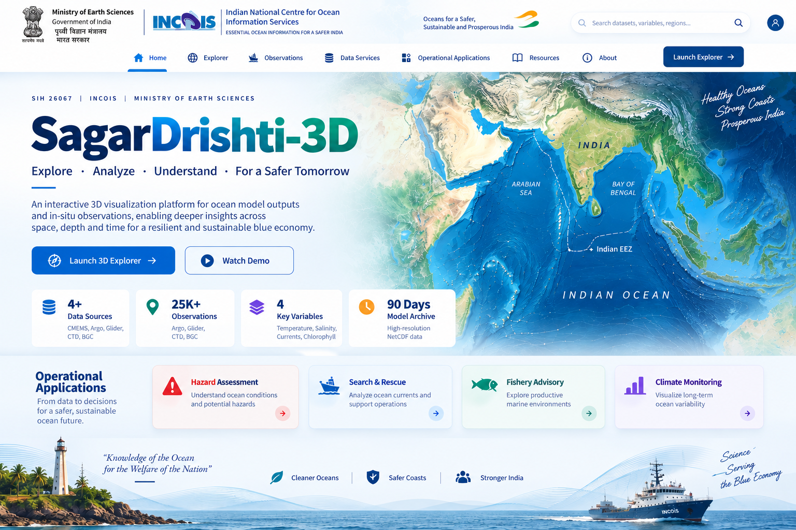

<p><sub><strong>01. Main Portal</strong> — Unified entry point for the ocean visualization platform and its scientific workspaces.</sub></p>

</div>

<table>
<tr>
<td width="50%" align="center" valign="top">

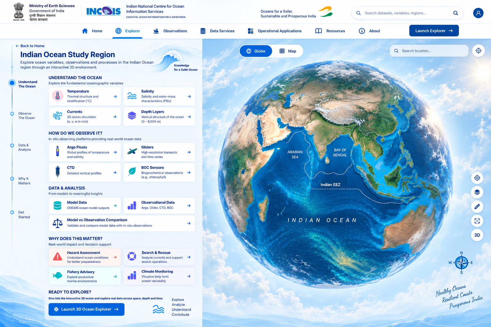

<br />

<sub><strong>02. Study Region</strong> — Interactive overview of the selected ocean region and available scientific datasets.</sub>

</td>

<td width="50%" align="center" valign="top">

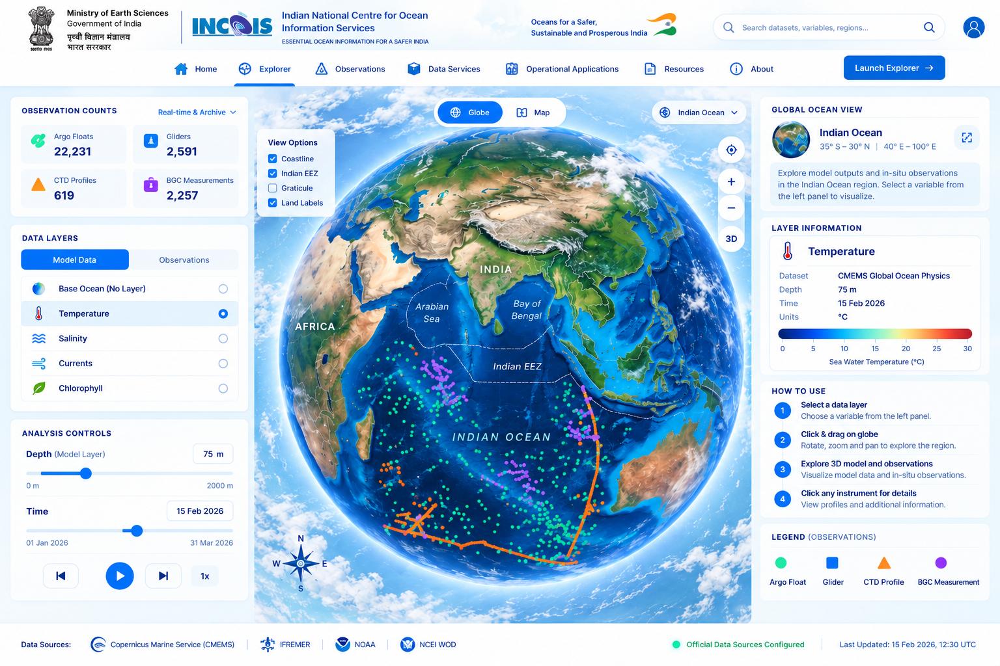

<br />

<sub><strong>03. 3D Ocean Explorer</strong> — Interactive global ocean environment with scientific data overlays.</sub>

</td>
</tr>

<tr>
<td width="50%" align="center" valign="top">

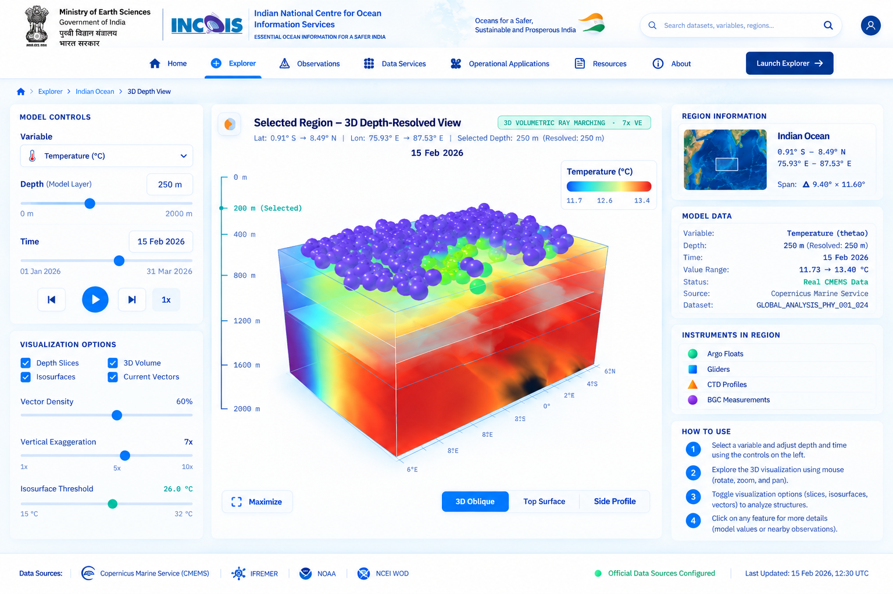

<br />

<sub><strong>04. Regional Scientific View</strong> — Detailed exploration of ocean model fields and scientific layers.</sub>

</td>

<td width="50%" align="center" valign="top">

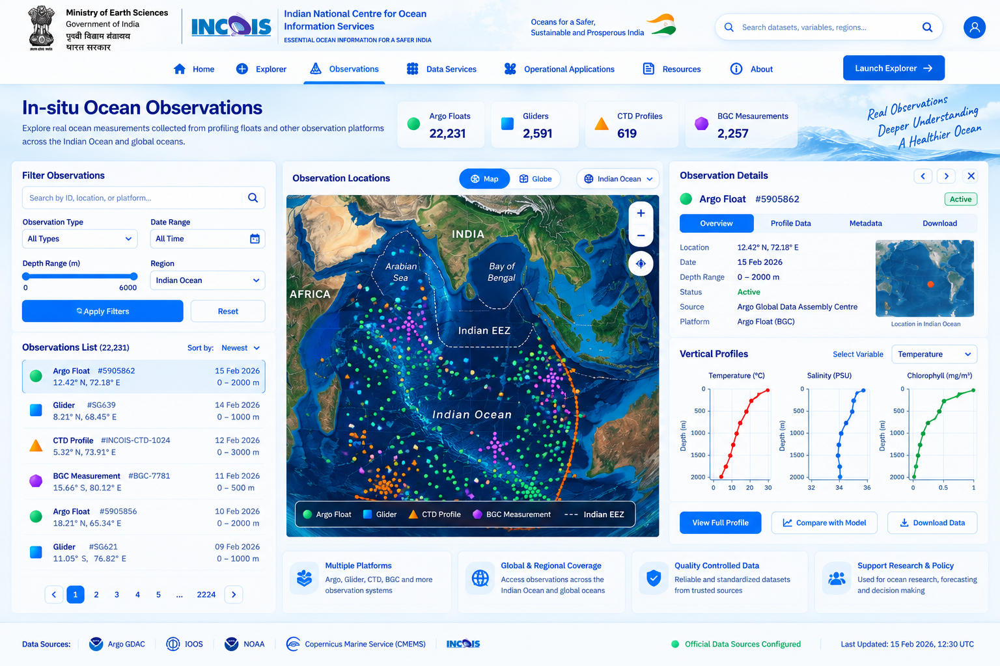

<br />

<sub><strong>05. Ocean Observations</strong> — Observation platforms, spatial distribution, and profile visualization.</sub>

</td>
</tr>

<tr>
<td width="50%" align="center" valign="top">

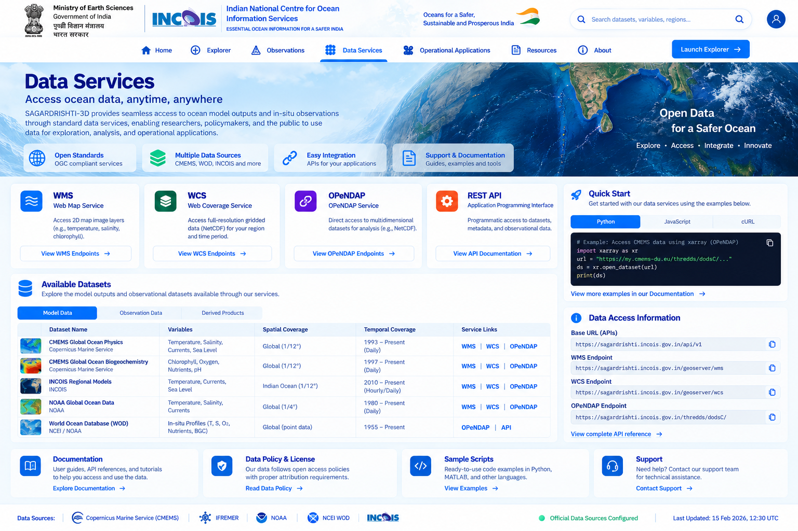

<br />

<sub><strong>06. Data Services</strong> — Access to scientific datasets through open standards and APIs.</sub>

</td>

<td width="50%" align="center" valign="top">

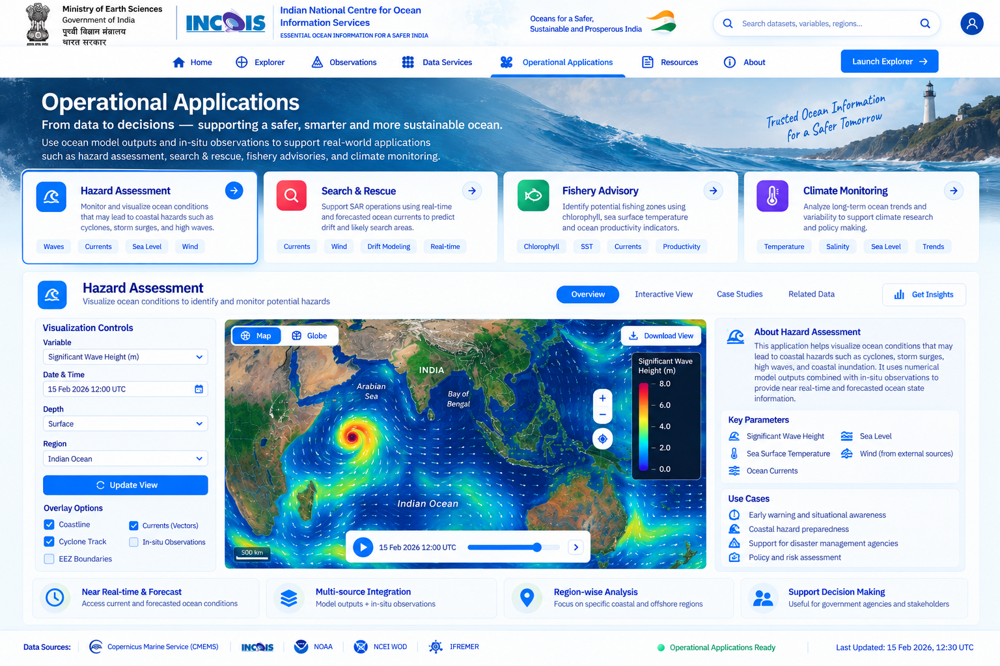

<br />

<sub><strong>07. Operational Applications</strong> — Domain-oriented ocean visualization workspaces.</sub>

</td>
</tr>
</table>

<details>
<summary><strong>📸 Additional Platform Screens</strong></summary>

<br />

<table>
<tr>
<td width="50%" align="center">

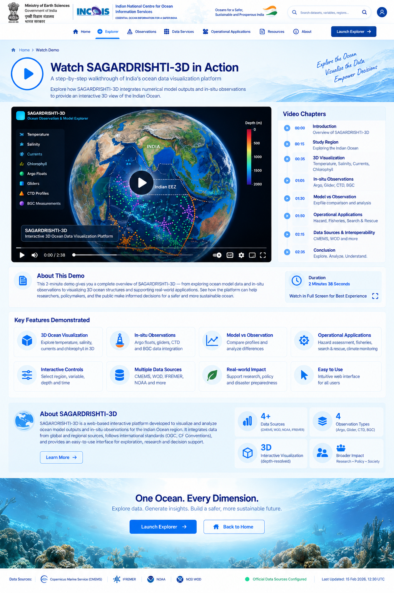

<br />

<sub><strong>08. Demo Walkthrough</strong> — Guided platform demonstration.</sub>

</td>

<td width="50%" align="center">

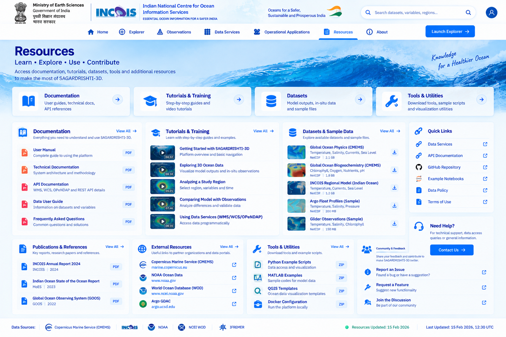

<br />

<sub><strong>09. Resources</strong> — Documentation and scientific references.</sub>

</td>
</tr>

<tr>
<td colspan="2" align="center">

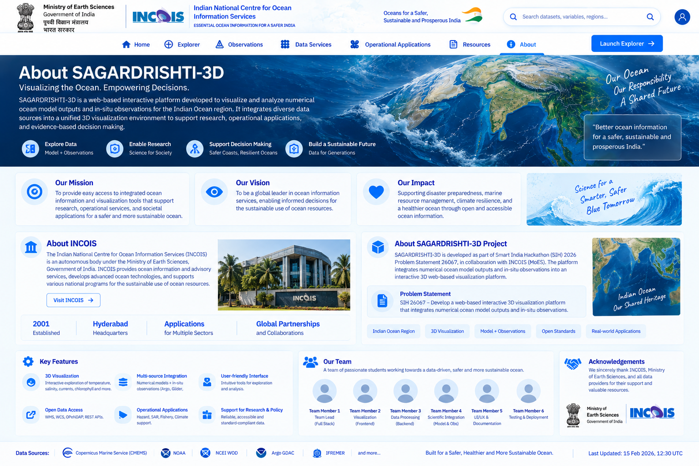

<br />

<sub><strong>10. About</strong> — Platform overview and architectural context.</sub>

</td>
</tr>
</table>

</details>

---

## 🌊 The Challenge

Oceanographic information originates from multiple independent observing and modelling systems.

These include:

- Numerical ocean models
- Profiling floats
- Autonomous underwater gliders
- Shipboard CTD observations
- Biogeochemical observations
- Geospatial boundaries and regional datasets

These datasets differ in format, spatial resolution, temporal resolution, coordinate systems, and access mechanisms.

The challenge is therefore not simply storing ocean data, but making heterogeneous scientific datasets **understandable, accessible, and comparable within one visual environment**.

> **Sagar Netra 3D creates a common browser-based scientific workspace for exploring, inspecting, and comparing ocean datasets.**

---

## 💡 From Fragmented Data to One Scientific Workspace

| Traditional Workflow | Sagar Netra 3D |
| :--- | :--- |
| Model datasets inspected through separate scientific tools | Interactive browser-based 3D visualization |
| Observation datasets analyzed independently | Observations displayed directly within the ocean environment |
| Static profile plots | Interactive observation profiles |
| Manual model/observation comparison | Integrated comparison workflow |
| Dataset-specific access mechanisms | Unified API and standards-based services |
| Surface-only visualization | Interactive three-dimensional ocean exploration |
| Static visualizations | Dynamic scientific controls |

---

## 🚀 What You Can Do

### 🌐 Interactive 3D Ocean

- Explore a global 3D ocean environment
- Select regional areas for detailed analysis
- Visualize scientific ocean variables
- Inspect spatial patterns and ocean structures
- Display current and flow information
- Adjust visualization parameters dynamically
- Navigate across available model timestamps

### 🌡️ Ocean Variables

The platform supports visualization of key oceanographic variables including:

- Temperature
- Salinity
- Ocean velocity
- Current speed and direction
- Chlorophyll concentration

### 🔬 In-Situ Observations

Supported observation categories include:

- Argo / profiling floats
- Autonomous gliders
- CTD observations
- Biogeochemical-capable observations

Users can select an observation and inspect its associated metadata and vertical profile.

### 📊 Model vs Observation

The platform provides an integrated workflow for comparing observational measurements with corresponding model data.

Comparison outputs include:

- Layer-wise residuals
- Mean bias
- Mean Absolute Error
- Root Mean Square Deviation

---

## 🗺️ Ocean Study Region

The platform currently focuses on the **Indian Ocean region**, including major areas such as:

- Arabian Sea
- Bay of Bengal
- Equatorial Indian Ocean

The regional workspace provides access to model fields, observation platforms, geospatial boundaries, and scientific visualization layers.

---

## 🛰️ Data Sources

The platform integrates data from established oceanographic sources, including:

| Source | Dataset Type | Content |
| :--- | :--- | :--- |
| **Copernicus Marine Service** | Numerical Ocean Models | Physical and biogeochemical ocean variables |
| **NOAA / NCEI World Ocean Database** | In-Situ Observations | Profiling floats, gliders and CTD observations |
| **Marine Regions / VLIZ** | Geospatial Data | Maritime boundary information |

> Dataset availability and coverage may change as the platform evolves.

---

## 🌐 Inside the 3D Explorer

The explorer is organized around two primary visualization experiences.

### Stage 1 — Global View

The global environment provides:

- Interactive 3D Earth
- Ocean data overlays
- Observation platform locations
- Regional boundary visualization
- Interactive region selection

### Stage 2 — Regional Scientific Workspace

After selecting a region, users can explore:

- Three-dimensional ocean fields
- Horizontal scientific layers
- Scalar field structures
- Ocean current visualization
- Dynamic scientific controls
- Temporal model exploration

The visualization engine is built using **Three.js and WebGL-based rendering technologies**.

---

## 🔬 From Observation to Scientific Profile

The observation workflow follows a simple sequence:

1. Locate an observation platform.
2. Select the platform.
3. Inspect observation metadata.
4. Open the associated vertical profile.
5. Compare the observation with corresponding model information.

This allows users to move from a spatial observation marker to detailed scientific analysis without leaving the platform.

---

## 📊 Scientific Comparison

The comparison workflow associates an observation with the corresponding model data and generates statistical diagnostics.

The primary metrics include:

### Residual

`Observation − Model`

### Mean Bias

Average signed difference between observations and model values.

### MAE

Mean absolute difference between observations and model values.

### RMSD

Root mean square difference between observations and model values.

These metrics provide a compact view of model-observation agreement.

---

## 📡 Open Scientific Data Services

The platform exposes scientific datasets through multiple access mechanisms.

### ⚡ REST API

Application-oriented endpoints for:

- Dataset metadata
- Model fields
- Observation data
- Scientific comparisons
- Geospatial information
- Data ingestion

### 🗺️ OGC WMS

Provides standards-based map visualization for supported scientific layers.

### 🧊 OGC WCS

Provides access to scientific coverage data and spatial subsets.

### 🌐 OPeNDAP

Provides remote access to multidimensional scientific datasets.

These services allow the platform to work not only as a visualization application but also as a scientific data access layer.

---

## 📥 Extensible Data Ingestion

The platform supports ingestion of observation datasets from common scientific text formats.

The ingestion pipeline performs:

1. File format detection
2. Column normalization
3. Variable mapping
4. Scientific validation
5. Duplicate detection
6. Dataset registration

This allows additional observation datasets to be incorporated without modifying the core visualization system.

---

## 🧩 Extensible Architecture

Sagar Netra 3D follows an adapter- and registry-oriented architecture.

### Adapter Layer

Provides a common interface for different scientific dataset formats and sources.

### Variable Registry

Centralizes supported ocean variables, units, aliases, and visualization metadata.

### Observation Registry

Maintains supported observation platform categories and associated capabilities.

### Source Registry

Tracks dataset sources and provenance information.

This architecture allows additional scientific datasets and observing systems to be integrated independently.

---

## 🧭 Operational Application Views

The platform includes domain-oriented visualization experiences demonstrating how integrated ocean information can support different analytical workflows.

### 🌪 Hazard Assessment

Explore physical ocean conditions and regional ocean structures.

### 🛟 Search & Rescue

Inspect ocean current fields and nearby observation information.

### 🐟 Fishery Advisory

Explore chlorophyll, temperature, and ocean circulation patterns that may provide useful environmental context.

### 🌍 Climate & Ocean Monitoring

Explore temporal and spatial variations in oceanographic conditions.

> These views are visualization and analytical workspaces. They are not intended to replace specialized operational forecasting systems.

---

## ⚡ Engineering

The platform is designed around efficient scientific data processing and GPU-accelerated visualization.

Key engineering concepts include:

- Lazy scientific dataset loading
- Spatial subsetting
- Adaptive data sampling
- Efficient numerical processing
- GPU-based 3D visualization
- Reusable WebGL resources
- Observation visualization optimization
- Scientific API services
- Standards-based geospatial interoperability

The architecture is designed to keep large scientific datasets outside the frontend bundle while transferring only the information required for visualization and analysis.

---

## 🏗️ System Architecture

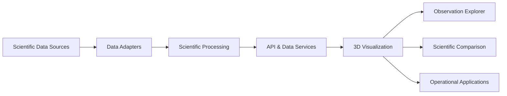

The system is composed of:

- Scientific data sources
- Dataset adapters
- Processing and validation services
- API and interoperability services
- Interactive 3D visualization
- Observation analysis
- Scientific comparison
- Domain-specific application views

---

## 📁 Project Structure

```text
dhrishti-3d/
├── app/                         # Next.js application routes
├── backend/                     # FastAPI scientific backend
│   ├── adapters/                # Scientific dataset adapters
│   ├── registry/                # Dataset and variable registries
│   ├── routers/                 # API and data-service routes
│   ├── schemas/                 # API and scientific schemas
│   ├── services/                # Scientific processing services
│   └── tests/                   # Automated tests
├── data/                        # Runtime scientific datasets
├── public/                      # Static assets
├── screenshots/                 # Platform screenshots
├── src/                         # Frontend components and visualization
├── Caddyfile                    # Reverse proxy configuration
├── docker-compose.yml           # Container orchestration
├── Dockerfile.frontend         # Frontend container
├── requirements.txt             # Backend dependencies
└── package.json                 # Frontend dependencies
```

---

## 📦 Runtime Dataset

The complete scientific runtime dataset is maintained separately from the source repository because of its size.

The dataset repository contains the required scientific resources for running the complete platform.

👉 **Dataset:** https://huggingface.co/datasets/kumar9513/data

### Download

Using Git LFS:

```bash
git lfs install
git clone https://huggingface.co/datasets/kumar9513/data hf-dataset
```

Or using Python:

```bash
pip install huggingface_hub

python -c "from huggingface_hub import snapshot_download; snapshot_download(repo_id='kumar9513/data', repo_type='dataset', local_dir='hf-dataset')"
```

Follow the dataset repository instructions for the current directory structure and required runtime resources.

---

## 🚀 Run Sagar Netra 3D

### 1. Clone

```bash
git clone https://github.com/sihfinal/dhrishti-3d.git
cd dhrishti-3d
```

### 2. Install Frontend Dependencies

```bash
pnpm install
```

### 3. Setup Python Environment

Python 3.10+ is recommended.

```bash
python -m venv .venv
```

Activate the environment:

```bash
# Linux / macOS
source .venv/bin/activate

# Windows PowerShell
.\.venv\Scripts\Activate.ps1
```

Install dependencies:

```bash
pip install -r requirements.txt
```

### 4. Start Backend

```bash
uvicorn backend.main:app --host 0.0.0.0 --port 8000 --reload
```

### 5. Start Frontend

```bash
pnpm dev
```

### 6. Open

```text
http://localhost:3000
```

---

## 🧑‍💻 First Look

A typical exploration workflow is:

1. Open the platform.
2. Review the available ocean datasets.
3. Enter the 3D Explorer.
4. Select an ocean variable.
5. Explore the global ocean environment.
6. Select a regional area.
7. Inspect scientific ocean structures.
8. Select an observation platform.
9. View its profile.
10. Compare observation and model information.
11. Explore available scientific data services.

---

## 🔌 API

The platform provides APIs for:

| Category | Purpose |
| :--- | :--- |
| Health | Service status |
| Datasets | Dataset discovery |
| Model | Ocean model metadata and fields |
| Observations | Observation discovery and profiles |
| Comparison | Model-observation analysis |
| Geospatial | Geographic information |
| Ingestion | Scientific dataset ingestion |
| WMS | Standards-based map visualization |
| WCS | Scientific coverage access |
| OPeNDAP | Remote multidimensional data access |

Refer to the running API documentation for the currently available routes and parameters.

---

## 🧪 Verification

The project includes automated backend tests and frontend production-build verification.

The development workflow includes:

- Python unit testing
- API testing
- Scientific service testing
- Data validation testing
- TypeScript validation
- Production frontend builds

---

## 🔒 Security & Data Integrity

The platform includes safeguards for scientific data processing and API access, including:

- Input validation
- Coordinate validation
- Depth/value validation
- File-type validation
- Path traversal protection
- Duplicate file detection
- Request parameter validation
- Resource limits for generated scientific outputs

---

## 🐳 Deployment

Production deployment configurations are included for containerized environments.

### Docker Compose

```bash
docker compose up -d --build
```

### Manual Deployment

The frontend can be built using:

```bash
pnpm build
```

The FastAPI backend can then be served using an ASGI server such as Uvicorn.

A reverse proxy can be used to expose the frontend and backend through a unified deployment.

---

## 🔭 Future Extensions

The architecture is designed to accommodate additional scientific datasets and observing systems.

Potential extensions include:

- Moored buoy observations
- Acoustic Doppler current observations
- Coastal radar datasets
- Additional biogeochemical parameters
- Additional numerical model products
- Machine-learning-derived ocean diagnostics
- Advanced scientific anomaly detection

---

## 🤝 Acknowledgements

The platform builds upon publicly available oceanographic datasets and scientific resources provided by organizations including:

- **Copernicus Marine Service**
- **NOAA / National Centers for Environmental Information**
- **Flanders Marine Institute / Marine Regions**
- Other open scientific and geospatial data providers

We acknowledge the scientific institutions and communities that maintain these datasets and standards.

---

## 📄 License

License: Not yet specified.

---

<div align="center">

<strong>🌊 Sagar Netra 3D — The Ocean Eye</strong>

<br />

<sub>Interactive Ocean Visualization & Scientific Data Exploration</sub>

</div>
