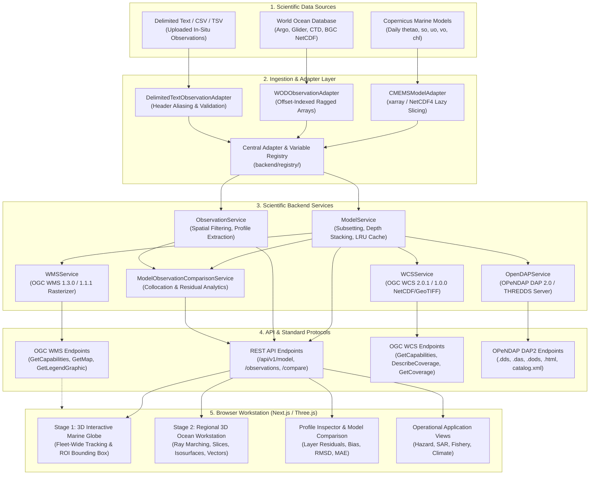

# 🌊 SagarDrishti-3D (सागरदृष्टि-3D)
### *Interactive 3D Ocean Model & Observation Visualization Platform*

[](https://www.sih.gov.in/)
[](https://incois.gov.in/)
[](https://nextjs.org/)
[](https://fastapi.tiangolo.com/)
[](https://threejs.org/)
[-10b981?style=for-the-badge&logo=pytest&logoColor=white)](#21-testing)
[](https://www.typescriptlang.org/)
[](https://huggingface.co/datasets/kumar9513/data)

---

## 2. Overview

Oceanographic research and operational marine workflows require correlating two distinct paradigms of marine data:
1. **Continuous 4D Numerical Ocean Circulation Models:** Spatially continuous, multi-depth hydrodynamic and biogeochemical simulations on discrete spatial grids.
2. **In-Situ Marine Observations:** Discrete Lagrangian and Eulerian vertical soundings collected at specific positions and timestamps by autonomous and ship-based instruments.

**SagarDrishti-3D** bridges this divide by providing an integrated, browser-based 3D visualization and analytical workstation focused on the **Indian Ocean Basin** (spanning the Arabian Sea, Bay of Bengal, and Equatorial Indian Ocean: $35^\circ\text{S} - 30^\circ\text{N}$, $40^\circ\text{E} - 100^\circ\text{E}$).

The platform enables oceanographers, researchers, and operational analysts to interactively explore multi-depth ocean physical and biogeochemical structures, perform collocated model-versus-observation residual analysis, and access standardized geospatial data services over open OGC and OPeNDAP interfaces.

---

## 3. Problem Statement

> **Smart India Hackathon (SIH 2026) — Problem Statement 26067**  
> **Title:** Develop a web-based interactive 3D visualization platform that integrates numerical ocean model outputs and in-situ observations.  
> **Organization:** Indian National Centre for Ocean Information Services (INCOIS), Ministry of Earth Sciences (MoES), Government of India.

---

## 4. Objectives

- **Interactive 3D Ocean Visualization:** Deliver GPU-accelerated volumetric rendering, horizontal depth slicing, 3D isosurfaces, and current velocity fields within standard web browsers.
- **Integrate Model & Observation Data:** Collocate gridded hydrodynamic model outputs with discrete observational soundings in a shared spatial reference frame.
- **Explore Ocean Variables through Depth & Time:** Support continuous multi-depth navigation from surface waters ($0.5\,\text{m}$) down to deep intermediate layers ($1000\,\text{m}+$) across daily timesteps.
- **Provide Scientific Profiles:** Render depth-resolved parameter curves (temperature, salinity, chlorophyll) for individual observation soundings.
- **Support Open Standards:** Expose OGC Web Map Service (WMS 1.3.0/1.1.1), OGC Web Coverage Service (WCS 2.0.1/1.0.0), and OPeNDAP DAP 2.0 protocols for direct integration with GIS and scientific clients.
- **Provide Reusable & Extensible Architecture:** Design registry-driven adapters and unified data schemas for ingestion of delimited ASCII/CSV/TSV files and future sensor streams.
- **Support Operational Visualization Views:** Provide tailored application perspectives for marine hazard assessment, search and rescue support, fishery habitat advisories, and climate archive analysis.

---

## 5. Key Features

| Capability | Technical Implementation | Repository Verification |
| :--- | :--- | :---: |
| **3D Volumetric Ray Marching** | WebGL2 direct volume casting through 3D scalar texture with front-to-back compositing | `src/lib/volumeRenderer.ts` |
| **3D Marching Cubes Isosurfaces** | Dynamic extraction of constant-value 3D surfaces (e.g., $20^\circ\text{C}$ thermocline envelope) | `src/lib/marchingCubes.ts` |
| **Horizontal Depth Slicing** | Multi-depth planes ($0.5\,\text{m} \to 1062.4\,\text{m}$) with colormapped contours and isoline borders | `src/components/page3/stage2/` |
| **3D Current Velocity Vectors** | Instanced directional arrows scaled by horizontal speed ($\text{speed} = \sqrt{u_o^2 + v_o^2}$) | `src/components/page3/stage2/` |
| **Observation Sounding Profiles** | In-situ platform markers with interactive depth profile modal charts down to $2000\,\text{m}$ | `src/components/page3/ObservationProfileChart.tsx` |
| **Model vs. Observation Comparison** | Nearest-neighbor spatial/depth collocation and layer residual calculation ($\text{Obs} - \text{Model}$) | `backend/services/comparison_service.py` |
| **Geospatial Indian EEZ Boundary** | Maritime boundary lines from Marine Regions (VLIZ) v12 dataset | `public/data/india_eez.geojson` |
| **Standardized Data Services** | High-performance FastAPI endpoints, OGC WMS, OGC WCS, and OPeNDAP DAP 2.0 servers | `backend/routers/` |
| **Delimited Data Ingestion** | CSV/TSV/ASCII parser with header normalization, coordinate validation, and deduplication | `backend/adapters/delimited_text.py` |
| **Scientific Visual Controls** | Scientific colormaps (Turbo, Viridis, Plasma, Coolwarm, YlGn), opacity, and $1\times \to 10\times$ vertical exaggeration | `src/components/page3/stage2/ModelControlPanel.tsx` |

---

## 6. System Architecture



---

## 7. Data Sources

| Source | Domain / Dataset | Variables / Content | Data Format | Temporal / Spatial Coverage |
| :--- | :--- | :--- | :--- | :--- |
| **Copernicus Marine (CMEMS)** | Global Physical Analysis/Forecast (`GLORYS12V1`) | Potential Temperature (`thetao`), Practical Salinity (`so`), Zonal Velocity (`uo`), Meridional Velocity (`vo`) | NetCDF-4 / CF-1.4 | Daily: 2026-01-01 to 2026-03-31 (90 timesteps)<br/>$35^\circ\text{S} - 30^\circ\text{N}$, $40^\circ\text{E} - 100^\circ\text{E}$ (40 depth levels: $0.5\,\text{m} \to 1942\,\text{m}$) |
| **Copernicus Marine (CMEMS)** | Global Biogeochemical Analysis (`FREEBIORYS2V4`) | Mass Concentration of Chlorophyll-a in Sea Water (`chl`) | NetCDF-4 / CF-1.6 | Daily: 2026-01-01 to 2026-03-31 (90 timesteps)<br/>$35^\circ\text{S} - 30^\circ\text{N}$, $40^\circ\text{E} - 100^\circ\text{E}$ (54 depth levels: $0.5\,\text{m} \to 1945\,\text{m}$) |
| **NOAA / NCEI WOD** | Profiling Floats (Argo / PFL) | In-situ Temperature, Salinity, Pressure, Dissolved Oxygen, Nitrate, Chlorophyll-a, pH | NetCDF-4 Ragged Arrays | 22,231 casts across the Indian Ocean basin |
| **NOAA / NCEI WOD** | Autonomous Gliders (GLD) | High-density saw-tooth vertical transects (Temperature, Salinity, Oxygen, Chlorophyll-a) | NetCDF-4 Ragged Arrays | 2,591 casts |
| **NOAA / NCEI WOD** | Conductivity-Temperature-Depth (CTD) | Deep-sea hydrographic baseline stations (Temperature, Salinity, Oxygen, Chlorophyll-a) | NetCDF-4 Ragged Arrays | 619 casts |
| **Marine Regions (VLIZ)** | World EEZ Dataset v12 | Maritime boundary lines (MRGID 8480, 8333) | GeoJSON (EPSG:4326) | Mainland India, Lakshadweep, Andaman & Nicobar ($2,323,948\,\text{km}^2$) |
| **Committed Offline Store** | SagarDrishti-3D Lightweight Cache | Quantized binary grids (`*.bin`), platform metadata, and coastlines | Binary Uint8 + JSON | Dedicated lightweight store in `public/data/` (<9 MB) for instant offline evaluation |

---

## 8. Ocean Variables

| Variable Name | NetCDF Identifier | Description | Units | Mathematical Formulation / Notes |
| :--- | :---: | :--- | :---: | :--- |
| **Potential Temperature** | `thetao` | Temperature of the water parcel moved adiabatically to standard surface reference pressure | $^\circ\text{C}$ | Derived from CMEMS physics model and WOD sensor thermistors |
| **Practical Salinity** | `so` | Practical salinity of sea water calculated on the PSS-78 scale | $\text{PSU}$ | Derived from CMEMS physics model and WOD conductivity cells |
| **Eastward Velocity** | `uo` | Zonal component of horizontal sea water velocity (positive eastward) | $\text{m/s}$ | CMEMS hydrodynamic flow field variable |
| **Northward Velocity** | `vo` | Meridional component of horizontal sea water velocity (positive northward) | $\text{m/s}$ | CMEMS hydrodynamic flow field variable |
| **Horizontal Current Speed** | — | Horizontal magnitude of the current velocity vector | $\text{m/s}$ | $$\text{speed} = \sqrt{u_o^2 + v_o^2}$$ |
| **Mass Concentration of Chlorophyll-a** | `chl` | Biogeochemical proxy for marine phytoplankton biomass | $\text{mg/m}^3$ | Derived from CMEMS biogeochemical model and calibrated bio-optical fluorometers |

---

## 9. Observation Types

The platform tracks and inspects discrete in-situ marine platforms across the Indian Ocean:

- 🟢 **Argo Profiling Floats (`argo` / `PFL`):** Autonomous robotic floats profiling between the surface and $2000\,\text{m}$ depth on 10-day cycles.
- 🔵 **Autonomous Underwater Gliders (`glider` / `GLD`):** Buoyancy-driven vehicles traversing horizontal saw-tooth survey patterns.
- 🟠 **Shipboard CTD Casts (`ctd`):** Hydrographic baseline soundings gathered during research expeditions.
- 🟣 **Biogeochemical-Capable Platforms (`bgc`):** Observation platforms equipped with calibrated bio-optical sensors measuring Chlorophyll-a alongside standard hydrography. *(Note: Only platforms with active optical fluorometers are classified as BGC; standard Argo floats measure physical parameters).*

### Interactive Sounding Capabilities
- **Spatial Positioning:** Rendered as interactive 3D spheres on the global Earth sphere.
- **Camera-Distance LOD & Clustering:** Markers dynamically cluster at distant orbital viewpoints and expand into individual inspection points as the user zooms in.
- **Sounding Selection & Header Metadata:** Clicking any platform displays its unique identifier (e.g., `argo_19770705`), latitude, longitude, and measurement timestamp.
- **Depth Profile Chart:** Modal inspection window plotting temperature ($^\circ\text{C}$), salinity ($\text{PSU}$), and chlorophyll ($\text{mg/m}^3$) continuous curves down the water column.

---

## 10. 3D Visualization

SagarDrishti-3D features a dual-stage visualization workflow:

### Stage 1: Global Digital Earth
- **WebGL Interactive Earth Sphere:** Atmospheric glow shaders, high-resolution satellite basemap, and national border boundaries.
- **Fleet-Wide Tracking:** Renders observation soundings across the basin with platform taxonomy markers.
- **Indian EEZ Layer:** Maritime boundary line overlay defining the Indian Exclusive Economic Zone based on Marine Regions (VLIZ) v12 data.
- **Interactive ROI Selection:** Click-and-drag 2D bounding box on the globe surface to isolate custom latitude/longitude regions of interest and transition into the 3D regional workstation.

### Stage 2: 3D Regional Workstation
- **GPU Direct Volume Ray Marching:** Direct ray casting through a 3D scientific data texture (`THREE.Data3DTexture`) using GLSL shaders with emission-absorption compositing and early ray termination.
- **3D Marching Cubes Isosurfaces:** Interactive extraction of constant-value 3D surfaces (e.g., the $20^\circ\text{C}$ thermocline boundary) using an internal 256-entry edge/triangle lookup table and dynamic isovalue sliders.
- **Multi-Depth Slicing Stack:** Coordinated horizontal depth planes ($0.5\,\text{m}, 11.4\,\text{m}, 25.2\,\text{m}, 55.8\,\text{m}, 109.7\,\text{m}, 222.5\,\text{m}, 541.1\,\text{m}, 1062.4\,\text{m}$) with colormapped contours and depth borders.
- **3D Velocity Vectors:** Directional 3D arrows oriented by $\theta = \text{atan2}(v_o, u_o)$ and scaled in length by $\text{speed} = \sqrt{u_o^2 + v_o^2}$.
- **Vertical Depth Exaggeration:** Dynamic $1\times \to 10\times$ depth slider expanding vertical layer separation for enhanced inspection of shallow bathymetry and thermocline gradients.
- **Temporal Playback Controls:** Time slider navigating across daily model timesteps (90 days from January to March 2026).

---

## 11. Model–Observation Analysis

The platform includes a dedicated comparative analysis engine (`backend/services/comparison_service.py` and `src/components/page3/ModelObsComparisonView.tsx`) to validate numerical model outputs against real physical measurements:

```
┌─────────────────────────┐             ┌─────────────────────────┐
│ In-Situ Observation     │             │ Gridded Model Dataset   │
│ Sounding (Lat, Lon, t)  │             │ (CMEMS NetCDF Archive)  │
└────────────┬────────────┘             └────────────┬────────────┘
             │                                       │
             ▼                                       ▼
    [Spatial Filtering]                     [Spatial Subsetting]
    Extract vertical array                  Nearest-neighbor grid cell
    (Depth, Obs Value)                      (Lat, Lon, Depth, Time)
             │                                       │
             └───────────────────┬───────────────────┘
                                 │
                                 ▼
                     [Layer-by-Layer Residual]
                     Residual = Obs - Model
                                 │
                                 ▼
                    [Statistical Error Metrics]
                    • Mean Bias: mean(Obs - Model)
                    • MAE: mean(|Obs - Model|)
                    • RMSD: sqrt(mean((Obs - Model)²))
```

1. **Spatial & Temporal Collocation:** The user selects an in-situ sounding. The comparison engine extracts the nearest horizontal grid coordinate from the CMEMS dataset and matches the observation timestamp to the daily model step.
2. **Vertical Sampling:** Model grid cells are sampled at the discrete depth levels recorded by the observational sensor.
3. **Layer Residuals:** Computes $\text{Residual}_i = \text{Observation}_i - \text{Model}_i$ for every sounding depth layer.
4. **Statistical Summaries:** Generates quantitative agreement metrics:
   - **Mean Bias:** Indicates systemic overestimation or underestimation.
   - **Mean Absolute Error (MAE):** Average magnitude of absolute discrepancies.
   - **Root Mean Square Deviation (RMSD):** Sensitivity to localized stratification deviations.

---

## 12. Data Services

SagarDrishti-3D exposes open scientific interfaces conforming to international geospatial and oceanographic data standards:

| Service Interface | Specification / Standard | Intended Consumer | Primary Capabilities |
| :--- | :--- | :--- | :--- |
| **REST API** | HTTP / JSON / Binary Octet-Stream | SagarDrishti Web Frontend & Custom Scripts | Model subgrids, depth stacks, observation profiles, and comparative metrics |
| **OGC WMS** | OGC Web Map Service 1.3.0 & 1.1.1 | QGIS, ArcGIS, Leaflet, OpenLayers | Geo-referenced raster map tiles with scientific colormaps and GetLegendGraphic |
| **OGC WCS** | OGC Web Coverage Service 2.0.1 & 1.0.0 | GDAL, Scientific GIS Clients, Python | Multidimensional spatial/depth/temporal coverage extraction in NetCDF-4 and GeoTIFF |
| **OPeNDAP DAP2** | NASA ESE / OPeNDAP DAP 2.0 Protocol | Python (`xarray`, `netCDF4`), MATLAB, R, CDO | Remote dataset opening, multidimensional slicing, and binary XDR streaming |

### Endpoints
- **Model Metadata:** `GET /api/v1/model/metadata`
- **Model Time Steps:** `GET /api/v1/model/times`
- **Model Vertical Depths:** `GET /api/v1/model/depths`
- **Model 2D Subgrid Field:** `GET /api/v1/model/field`
- **Model Multi-Depth Stack:** `GET /api/v1/model/field-stack`
- **Observation Platforms:** `GET /api/v1/observations/platforms`
- **Observation Platform Detail:** `GET /api/v1/observations/{id}`
- **Observation Sounding Profile:** `GET /api/v1/observations/{id}/profile`
- **Model vs. Observation Comparison:** `GET /api/v1/compare/model-observation`
- **Indian EEZ GeoJSON:** `GET /api/v1/geospatial/india-eez`
- **OGC WMS Service:** `GET /api/v1/ogc/wms`
- **OGC WCS Service:** `GET /api/v1/ogc/wcs`
- **OPeNDAP DAP2 Catalog & Streams:** `GET /api/v1/opendap/{dataset}.[dds|das|dods|html]`

---

## 13. Data Ingestion

The ingestion subsystem (`backend/adapters/delimited_text.py` and `backend/services/ingestion_service.py`) enables ingesting external observation files:

```
Delimited File (.csv, .tsv, .txt, .dat)
  │
  ├── 1. Delimiter Sniffing (comma, tab, semicolon, pipe)
  ├── 2. Header & Column Alias Normalization (lat/latitude/y, lon/longitude/x, depth/z/pressure)
  ├── 3. Scientific Range Validation (lat: -90..90, lon: -180..180, depth >= 0, ISO timestamps)
  ├── 4. Variable Mapping via VariableRegistry (temperature, salinity, chlorophyll)
  ├── 5. SHA-256 Checksum Calculation (Duplicate Prevention)
  └── 6. Transformation to UnifiedObservation & UnifiedProfilePoint schemas
```

- **Supported Formats:** Comma-separated (CSV), tab-separated (TSV), semicolon-delimited, pipe-delimited, and whitespace-delimited ASCII tables.
- **Directory Monitoring:** The ingestion service can scan `data/incoming/` to detect newly placed files, validate their syntax, and record job statuses (`DISCOVERED`, `VALIDATING`, `INGESTED`, `PARTIALLY_INGESTED`, `FAILED`, `REJECTED`, or `SKIPPED_DUPLICATE`).

---

## 14. Extensible Architecture

The backend utilizes an adapter-and-registry pattern to decouple concrete file structures from API endpoints:

```
[ External Data Source ]
         │
         ▼
[ Concrete Adapter ] (inherits BaseModelAdapter or BaseObservationAdapter)
         │
         ▼
[ Normalized Unified Schemas ] (UnifiedObservation, UnifiedProfilePoint)
         │
         ▼
[ Central Registries ]
├── AdapterRegistry: Maps source IDs to adapter implementations
├── VariableRegistry: Standardizes physical variables, units, and aliases
├── ObservationTypeRegistry: Manages platform metadata and marker taxonomy
└── SourceRegistry: Manages dataset origins and citation metadata
         │
         ▼
[ Service & API Layer ] (WMS, WCS, OPeNDAP, REST Endpoints)
```

### Extension Points for Future Sensor Modalities
The registry architecture includes predefined extension hooks for additional oceanographic instrumentation:
- **Moorings / Fixed Buoys (`mooring`):** Fixed geographic time series soundings.
- **Acoustic Doppler Current Profilers (`adcp`):** High-resolution vertical current velocity profiles.
- **High-Frequency Radar (`hf_radar`):** Coastal surface current velocity vector fields.

> *Note: These sensor definitions exist in the registry as extension specifications (`is_active=False`) and do not generate synthetic data.*

---

## 15. Operational Applications

The platform includes four demonstration application views (`app/operational-applications/page.tsx`) illustrating how ocean model parameters and observation soundings inform decision-making:

### 1. Marine Hazard Assessment
- **Demonstrated Visualization:** Sea surface temperature distribution, subsurface heat content gradients, salinity fronts, and surface current velocity fields alongside in-situ observation soundings.
- **Operational Utility:** Provides physical context regarding thermal gradients and currents that influence marine operations and storm tracking environments. *(Note: Does not perform atmospheric cyclone prediction).*

### 2. Search & Rescue (SAR) Support
- **Demonstrated Visualization:** Surface and sub-surface current velocity vectors ($u_o, v_o$, speed $\text{speed} = \sqrt{u_o^2 + v_o^2}$), flow direction, and positions of nearby drifting observation platforms (Argo floats).
- **Operational Utility:** Visualizes ocean surface circulation patterns to evaluate trajectory trends in marine recovery operations. *(Note: Does not perform automated Lagrangian drift forecasting).*

### 3. Fishery Advisory & Habitat Mapping
- **Demonstrated Visualization:** Chlorophyll-a concentration fields from the CMEMS biogeochemical model, sea surface temperature gradients, and localized thermal divergence zones collocated with BGC sensor soundings.
- **Operational Utility:** Identifies biological productive zones and thermal fronts associated with pelagic feeding grounds. *(Note: Does not perform fish-stock population forecasting).*

### 4. Climate & Ocean Archive Monitoring
- **Demonstrated Visualization:** Temporal navigation across the 90-day physical and biogeochemical ocean model archive, vertical thermocline displacement, and deep-ocean observation time series down to $2000\,\text{m}$.
- **Operational Utility:** Explores seasonal hydrographic variability across the Indian Ocean basin. *(Note: Does not perform decadal climate forecasting).*

---

## 16. Performance & Engineering

The platform incorporates specific software and data engineering optimizations:

- **Thread-Safe Bounded LRU NetCDF File-Handle Caching:** `backend/adapters/cmems_model.py` maintains an `OrderedDict` LRU cache (16 active dataset handles) protected by a threading lock to avoid file-reopen overhead during concurrent tile requests.
- **GZip Response Compression:** FastAPI server enables `GZipMiddleware` for responses exceeding $1024\,\text{bytes}$, reducing bandwidth consumption for JSON and GeoJSON payloads.
- **$O(1)$ WOD Profile Lookup via Cumulative Offsets:** `backend/adapters/wod_observations.py` precomputes cumulative offset arrays for ragged-array NetCDF dimensions (`z_obs`, `Temperature_obs`), enabling constant-time cast seeking.
- **Field-Stack API:** `GET /api/v1/model/field-stack` retrieves multiple horizontal depth slices in a single round-trip, minimizing HTTP handshakes during 3D scene construction.
- **Lazy Slicing with Adaptive Stride:** `xarray` coordinates are indexed lazily using `.sel()` and downsampled via spatial stride ($1\times \to 8\times$) based on client viewport demands.
- **Single-Precision Processing:** Numerical arrays are normalized to `float32` before transmission, halving memory footprint compared to default 64-bit precision.
- **Three.js GPU Memory Management:** Reuses persistent geometries, shader materials, and instanced meshes, invoking explicit `.dispose()` handlers upon teardown to prevent WebGL context leaks.
- **Camera-Distance Observation LOD:** Groups dense observation markers into clustered representations at distant orbital camera positions, expanding to individual inspection spheres as the user zooms in.
- **GPU Ray Marching with Early Termination:** Volume shader samples the 3D data texture along viewing rays and terminates traversal once opacity reaches saturation ($A \ge 0.98$).

---

## 17. Project Structure

```text
├── app/                                    # Next.js App Router Pages
│   ├── about/page.tsx                      # Platform & institutional background
│   ├── data-services/page.tsx              # Interactive OGC & REST API catalog
│   ├── explore/page.tsx                    # Main 3D workstation entry point
│   ├── observations/page.tsx               # Observation platform registry & filter
│   ├── operational-applications/page.tsx   # Four operational application views
│   ├── resources/page.tsx                  # Scientific documentation & resources
│   ├── study-region/page.tsx               # Indian Ocean geographic domain guide
│   └── watch-demo/page.tsx                 # Platform video demonstration walkthrough
├── backend/                                # Python FastAPI Scientific Server
│   ├── adapters/                           # Concrete data adapters
│   │   ├── base.py                         # Abstract BaseModelAdapter & BaseObservationAdapter
│   │   ├── cmems_model.py                  # Copernicus Marine NetCDF-4 model adapter
│   │   ├── delimited_text.py               # CSV/TSV/ASCII parser & validator
│   │   └── wod_observations.py             # NOAA WOD ragged-array observation adapter
│   ├── registry/                           # Central registry subsystem
│   │   ├── adapters.py                     # Adapter class registry
│   │   ├── observation_types.py            # Platform metadata & sensor taxonomy
│   │   ├── sources.py                      # Dataset provenance registry
│   │   └── variables.py                    # Standard oceanographic variable definitions
│   ├── routers/                            # FastAPI API route modules
│   │   ├── comparison.py                   # Model vs. observation residual endpoints
│   │   ├── geospatial.py                   # Indian EEZ GeoJSON & boundary info
│   │   ├── ingestion.py                    # Upload & file ingestion endpoints
│   │   ├── model.py                        # Model metadata, fields, and field-stack
│   │   ├── observations.py                 # Observation query & profile endpoints
│   │   ├── opendap.py                      # OPeNDAP DAP 2.0 & THREDDS endpoints
│   │   ├── wcs.py                          # OGC WCS 2.0.1 / 1.0.0 coverage endpoints
│   │   └── wms.py                          # OGC WMS 1.3.0 / 1.1.1 map rasterizer
│   ├── schemas/                            # Pydantic data validation schemas
│   ├── services/                           # Domain business logic services
│   └── tests/                              # Automated Pytest suite (102 test cases)
├── data/                                   # Local NetCDF model & observation store
├── public/                                 # Static web assets
│   ├── data/                               # Committed lightweight binary store (<9 MB)
│   │   ├── coastlines.json                 # Global coastline vector geometry
│   │   ├── currents.bin                    # Quantized HYCOM horizontal velocity field
│   │   ├── india_eez.geojson               # Indian EEZ boundary representation
│   │   ├── manifest.json                   # Variable dimensions & quantization scales
│   │   ├── profiles.json                   # In-situ platform metadata & soundings
│   │   └── *.bin                           # Quantized temperature & salinity grids
│   └── textures/                           # Satellite Earth & atmospheric maps
├── src/                                    # Frontend Source Code
│   ├── components/                         # React UI & Three.js canvas components
│   │   ├── observations/                   # Observation map viewers & detail modals
│   │   └── page3/                          # Stage 1 Globe & Stage 2 Workstation UI
│   │       ├── globe/                      # EarthSphere & IndianEEZLayer
│   │       └── stage2/                     # Ray Marcher, Slices, Isosurfaces, Vectors
│   ├── lib/                                # API clients, binary decoders, marching cubes
│   └── scene/                              # Three.js 3D scene root & background
├── docker-compose.yml                      # Containerized production stack configuration
├── Dockerfile.frontend                     # Multi-stage Nginx build for Next.js static export
├── requirements.txt                        # Root Python dependencies
└── package.json                            # Node.js dependencies & build scripts
```

---

## 18. Installation

### Prerequisites
- **Node.js:** v18.x or v20.x
- **Package Manager:** `pnpm` (recommended) or `npm`
- **Python:** v3.10 or v3.11
- **C/C++ Build Tools:** Required on some platforms for compiling `netCDF4` / `h5py`

---

### Step 1: Clone the Repository
```bash
git clone https://github.com/sihfinal/dhrishti-3d.git
cd dhrishti-3d
```

### Step 2: Install Dependencies

#### Frontend:
```bash
pnpm install
```

#### Backend:
```bash
# Create and activate a Python virtual environment
python -m venv .venv

# Windows:
.\.venv\Scripts\activate
# Linux / macOS:
source .venv/bin/activate

# Install all backend scientific dependencies
pip install -r requirements.txt
```

---

### Step 3: Run the Application

#### Start the Python FastAPI Backend (Port 8000):
```bash
uvicorn backend.main:app --host 0.0.0.0 --port 8000 --reload
```
- Swagger UI / OpenAPI Documentation: `http://localhost:8000/docs`
- Service Health Endpoint: `http://localhost:8000/api/v1/health`

#### Start the Next.js Frontend (Port 3000):
In a separate terminal window:
```bash
pnpm dev
```
Open **`http://localhost:3000`** in your browser.

---

### Docker Deployment (Alternative)
The repository includes container specifications for multi-container deployment:
```bash
docker compose up -d --build
```
- Frontend: `http://localhost:3000`
- Backend: `http://localhost:8000`

---

## 19. API Quick Start

The FastAPI backend serves both JSON metadata and binary grid slices:

### 1. Retrieve Model Metadata
```bash
curl -X GET "http://localhost:8000/api/v1/model/metadata"
```

### 2. Extract a 2D Subgrid Field
Extracts a horizontal temperature grid slice at $0.5\,\text{m}$ depth on 2026-02-15 within the Arabian Sea:
```bash
curl -X GET "http://localhost:8000/api/v1/model/field?variable=temperature&depth=0.5&time=2026-02-15&lat_min=10.0&lat_max=22.0&lon_min=60.0&lon_max=75.0&stride=1"
```

### 3. Query In-Situ Observation Platforms
Query active Argo profiling floats in a spatial bounding box:
```bash
curl -X GET "http://localhost:8000/api/v1/observations/platforms?type=argo&lat_min=0.0&lat_max=20.0&lon_min=60.0&lon_max=80.0&limit=10"
```

### 4. Perform Model vs. Observation Comparison
Compares sounding `argo_19770705` against the collocated CMEMS numerical model:
```bash
curl -X GET "http://localhost:8000/api/v1/compare/model-observation?obs_id=argo_19770705&variable=temperature"
```

---

## 20. OGC & Scientific Data Usage

### OGC Web Map Service (WMS)
- **GetCapabilities (WMS 1.3.0):**
  ```text
  GET http://localhost:8000/api/v1/ogc/wms?SERVICE=WMS&REQUEST=GetCapabilities&VERSION=1.3.0
  ```
- **GetMap (Render 2D Temperature Raster with Turbo Colormap):**
  ```text
  GET http://localhost:8000/api/v1/ogc/wms?SERVICE=WMS&REQUEST=GetMap&VERSION=1.3.0&LAYERS=temperature&STYLES=turbo&CRS=EPSG:4326&BBOX=-20,55,15,85&WIDTH=800&HEIGHT=600&FORMAT=image/png&TIME=2026-02-15&ELEVATION=0.5
  ```
- **GetLegendGraphic:**
  ```text
  GET http://localhost:8000/api/v1/ogc/wms?SERVICE=WMS&REQUEST=GetLegendGraphic&LAYER=temperature&STYLE=turbo&FORMAT=image/png
  ```

### OGC Web Coverage Service (WCS)
- **GetCapabilities (WCS 2.0.1):**
  ```text
  GET http://localhost:8000/api/v1/ogc/wcs?SERVICE=WCS&REQUEST=GetCapabilities&VERSION=2.0.1
  ```
- **DescribeCoverage:**
  ```text
  GET http://localhost:8000/api/v1/ogc/wcs?SERVICE=WCS&REQUEST=DescribeCoverage&VERSION=2.0.1&COVERAGEID=temperature
  ```
- **GetCoverage (Subset NetCDF-4 Output):**
  ```text
  GET http://localhost:8000/api/v1/ogc/wcs?SERVICE=WCS&REQUEST=GetCoverage&VERSION=2.0.1&COVERAGEID=temperature&SUBSET=Lat(-20,15)&SUBSET=Long(55,85)&SUBSET=time("2026-02-15")&SUBSET=elevation(0.5)&FORMAT=application/x-netcdf
  ```

### OPeNDAP DAP 2.0 Protocol
- **Dataset Descriptor Structure (DDS):**
  ```text
  GET http://localhost:8000/api/v1/opendap/cmems_physical.dds
  ```
- **Dataset Attribute Structure (DAS):**
  ```text
  GET http://localhost:8000/api/v1/opendap/cmems_physical.das
  ```
- **DODS Binary Data Stream:**
  ```text
  GET http://localhost:8000/api/v1/opendap/cmems_physical.dods?thetao[0:1:0][0:1:2][10:1:20][10:1:20]
  ```

---

## 21. Testing

The platform maintains automated test coverage across all scientific backend modules:

```bash
# Run the complete Python test suite
pytest backend/tests
```

### Verified Test Suite Execution Output
```text
============================= test session starts =============================
platform win32 -- Python 3.11.5, pytest-9.1.1
rootdir: C:\...\dhrishti-3d
collected 102 items

backend\tests\test_api.py ........................................       [ 39%]
backend\tests\test_comparison.py ....                                    [ 43%]
backend\tests\test_delimited_text_and_ingestion.py ........              [ 50%]
backend\tests\test_extensible_architecture.py ...............            [ 65%]
backend\tests\test_geospatial.py ..                                      [ 67%]
backend\tests\test_opendap.py .............                              [ 80%]
backend\tests\test_wcs.py ..........                                     [ 90%]
backend\tests\test_wms.py ..........                                     [100%]

====================== 102 passed, 2 warnings in 56.73s =======================
```

### Frontend Build Verification
```bash
pnpm build
```
- **Static Export Generation:** Compiled successfully with Next.js Turbopack across all 13 application routes with strict TypeScript 5.7 type-checking (0 compiler errors).

---

## 22. Security

- **Path Traversal Protection:** Input file paths within data adapters and ingestion endpoints are strictly resolved against designated data directories (`data/` and `data/incoming/`), rejecting directory traversal attempts (`../`).
- **Input Validation:** API query parameters are validated using Pydantic schemas, enforcing bounds on geographical coordinates ($-90^\circ \le \text{latitude} \le 90^\circ$, $-180^\circ \le \text{longitude} \le 180^\circ$) and non-negative depths.
- **Resource Constraints:** The WMS rasterizer enforces maximum image dimension limits ($2048 \times 2048\,\text{pixels}$) to prevent denial-of-service memory exhaustion.
- **Controlled File Uploads:** Upload endpoints enforce extension whitelisting (`.csv`, `.tsv`, `.txt`, `.dat`, `.ascii`, `.nc`) and compute SHA-256 fingerprints to prevent duplicate processing.

---

## 23. Deployment

The platform supports two deployment architectures:

1. **Integrated Containerized Deployment (Docker Compose):**
   - Defined in [docker-compose.yml](file:///c:/Users/KumarShiva/Downloads/SIH_2026/26067/SIH_2026_26067/docker-compose.yml).
   - Frontend container builds Next.js static output and serves it via an Alpine Nginx server on port `3000`.
   - Backend container runs the Python 3.11 FastAPI server via Uvicorn on port `8000`, with `./data` mounted as a volume.
2. **Decoupled Deployment:**
   - **Frontend:** Static export (`out/`) deployable to any static host (Netlify, Vercel, Cloudflare Pages, or AWS S3).
   - **Backend:** FastAPI container or systemd service deployable to a Linux VPS or cloud instance, with `NEXT_PUBLIC_API_URL` pointing to the API gateway.

---

## 24. Future Scope

To ensure scientific and engineering clarity, existing capabilities are strictly distinguished from planned extensions:

### Currently Implemented
- WebGL2 GPU direct volume ray marching through 3D data textures.
- Standalone 3D Marching Cubes isosurface extraction with dynamic isovalue sliders.
- Multi-depth horizontal slicing stack ($0.5\,\text{m} \to 1062.4\,\text{m}$).
- Directional current velocity vectors scaled by $\text{speed} = \sqrt{u_o^2 + v_o^2}$.
- Real CMEMS physical (`thetao`, `so`, `uo`, `vo`) and biogeochemical (`chl`) model slicing across 90 daily timesteps.
- In-situ profile inspection for Argo, Glider, and CTD platforms.
- Model vs. Observation residual computation and statistical error metrics (MAE, RMSD, Bias).
- OGC WMS (1.3.0/1.1.1), OGC WCS (2.0.1/1.0.0), and OPeNDAP DAP 2.0 servers.
- CSV/TSV/ASCII delimited file ingestion with header alias normalization and duplicate detection.

### Future Extensions
- **Moored Buoy Arrays:** Integration of high-frequency fixed time-series observations (e.g., RAMA buoy array).
- **Acoustic Doppler Current Profiler (ADCP):** Ingestion and rendering of vertical current velocity profiles gathered by shipboard ADCP surveys.
- **High-Frequency (HF) Radar:** Ingestion of coastal surface current velocity fields.
- **Additional Biogeochemical Variables:** Support for dissolved oxygen ($\text{O}_2$), nitrate ($\text{NO}_3$), and pH from expanded BGC sensor arrays.
- **Machine Learning Products:** Integration of data-driven derived products (e.g., automated marine heatwave detection).

---

## 25. Team

*Smart India Hackathon 2026 — Team Information:*

| Role | Name | Department / Affiliation |
| :--- | :--- | :--- |
| **Team Lead / Full-Stack & 3D Graphics** | Kumar Shiva | Engineering |
| **Backend & Scientific Data Services** | Team Member | Engineering |
| **Oceanographic Data & Testing** | Team Member | Engineering |

*(Update team details as appropriate for hackathon submission).*

---

## 26. Acknowledgements & Data Sources

We gratefully acknowledge the following organizations and data providers:
- **Indian National Centre for Ocean Information Services (INCOIS)**, Ministry of Earth Sciences (MoES), Government of India: For problem statement formulation, scientific domain guidance, and evaluation criteria under SIH 26067.
- **Copernicus Marine Environment Monitoring Service (CMEMS):** For providing the Global Ocean Physics (`GLORYS12V1`) and Biogeochemical (`FREEBIORYS2V4`) analysis datasets.
- **NOAA National Centers for Environmental Information (NCEI):** For the World Ocean Database (WOD) in-situ observation archives (Argo profiling floats, gliders, and CTD casts).
- **International Argo Programme:** For global in-situ profiling float measurements.
- **Flanders Marine Institute (VLIZ):** For the Marine Regions World Maritime Boundaries Dataset v12 (MRGID 8480, 8333).

---

## 27. License

License: Not yet specified.

---

## 28. Footer

Built for Smart India Hackathon 2026 — SIH 26067
