<div align="center">


# 🌊 SagarDrishti-3D

### Interactive 3D Ocean Model & Observation Visualization Platform

**Explore • Visualize • Compare • Understand**

[](https://www.sih.gov.in/)
[](https://incois.gov.in/)
[](https://nextjs.org/)
[](https://www.typescriptlang.org/)
[](https://fastapi.tiangolo.com/)
[](https://threejs.org/)
[](https://docs.xarray.dev/)
[](#-verification)
[](https://huggingface.co/datasets/kumar9513/data)

<br />

**SagarDrishti-3D** is a browser-based scientific visualization platform developed for **Smart India Hackathon 2026 (PS 26067)** under the **Indian National Centre for Ocean Information Services (INCOIS), Ministry of Earth Sciences (MoES), Government of India**. It integrates 4D numerical ocean model outputs with real in-situ observations and presents them through an interactive 3D environment.

Instead of viewing gridded model fields, vertical observation soundings, profile comparisons, and standardized geospatial services in isolated tools, the platform brings them together into a single exploration and analysis workspace.

</div>

---

## 🌐 See the Ocean as Data

<table>
  <tr>
    <td width="33%" valign="top">
      <h3>🌊 Explore</h3>
      <p>Navigate interactive 3D ocean fields across horizontal space, vertical water-column depths, and daily model timesteps using WebGL2 volume rendering, depth slices, Marching Cubes isosurfaces, and current vectors.</p>
    </td>
    <td width="33%" valign="top">
      <h3>🔬 Compare</h3>
      <p>Inspect real in-situ observation soundings (Argo floats, autonomous gliders, CTD casts, and BGC sensors) alongside collocated numerical ocean model grids with layer-by-layer residual metrics.</p>
    </td>
    <td width="33%" valign="top">
      <h3>📡 Access</h3>
      <p>Consume multidimensional ocean datasets directly through REST JSON/binary endpoints, OGC Web Map Service (WMS), OGC Web Coverage Service (WCS), and OPeNDAP DAP2 streams.</p>
    </td>
  </tr>
</table>

### Platform Gallery

<div align="center">
  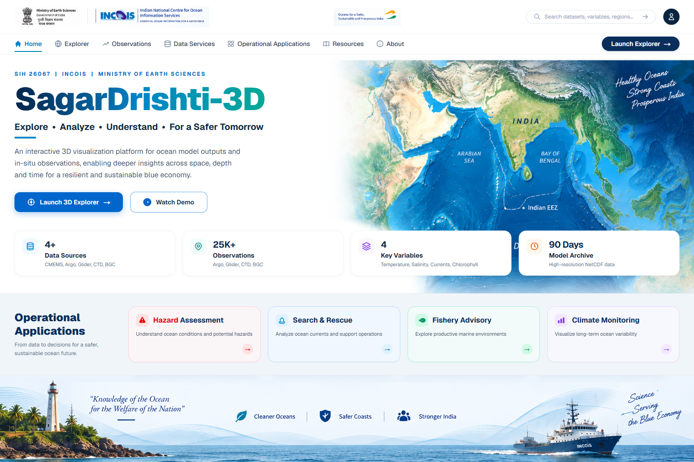
  <p><em>SagarDrishti-3D Main Portal — Unified entry point for the 3D Explorer, Observation Registry, OGC Data Services, and Operational Application Views.</em></p>
</div>

<table>
  <tr>
    <td width="50%" align="center">
      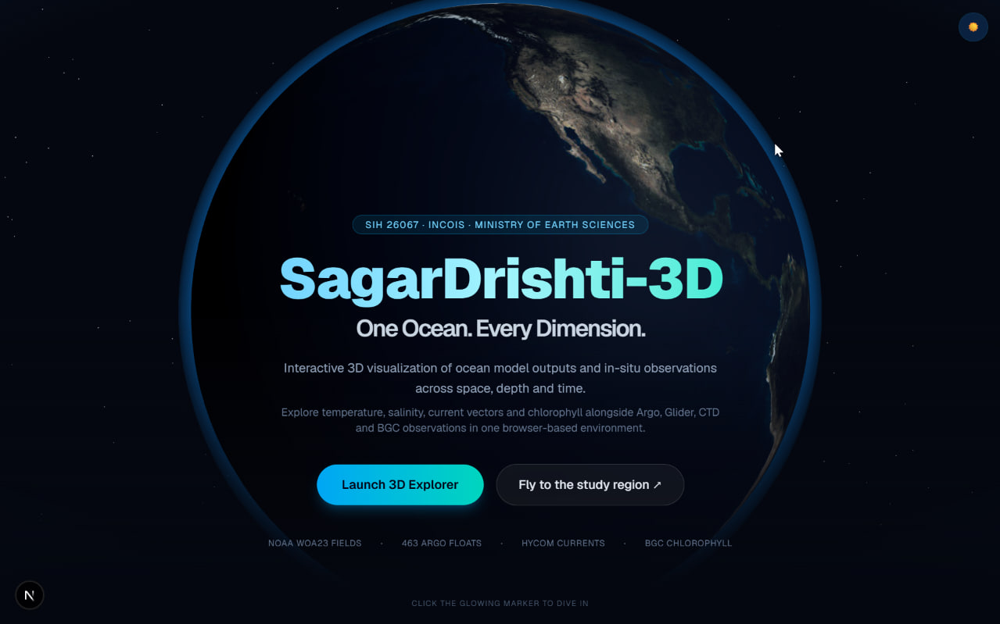
      <br />
      <sub><strong>3D Interactive Globe Entry</strong> — Browser-based orbital view with direct study region navigation.</sub>
    </td>
    <td width="50%" align="center">
      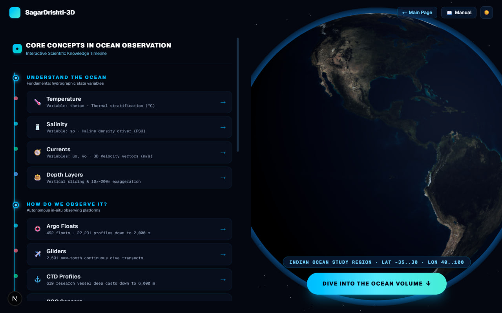
      <br />
      <sub><strong>Indian Ocean Study Domain</strong> — Interactive parameter and observation platform overview.</sub>
    </td>
  </tr>
  <tr>
    <td width="50%" align="center">
      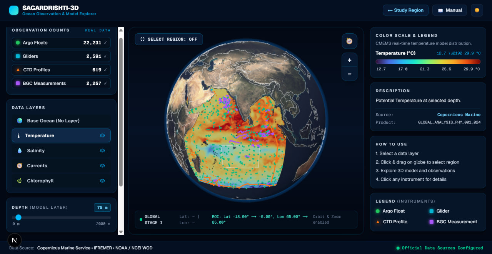
      <br />
      <sub><strong>Stage 1: Global Basin Overview</strong> — CMEMS scalar distribution, Indian EEZ boundary, and in-situ markers.</sub>
    </td>
    <td width="50%" align="center">
      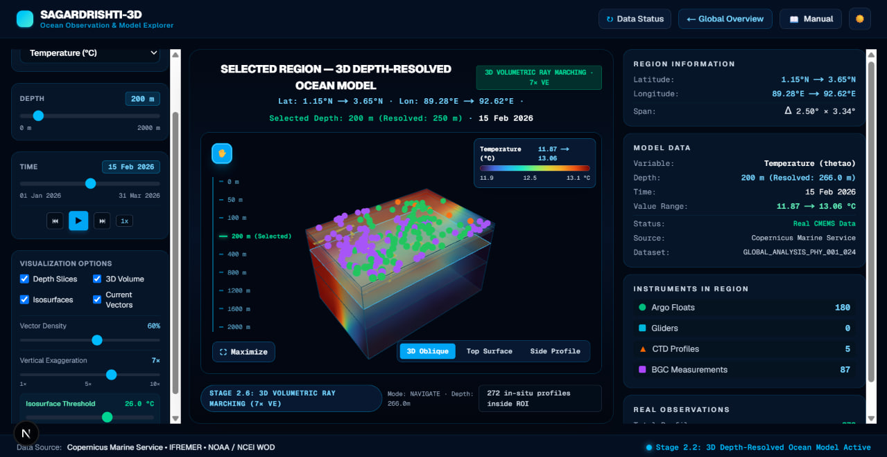
      <br />
      <sub><strong>Stage 2: 3D Regional Workstation</strong> — GPU volumetric ray marching, depth slices, isosurfaces, and collocated profiles.</sub>
    </td>
  </tr>
</table>

---

## 🌊 The Challenge

Oceanographic information originates from multiple independent observing and modelling systems:

- **Numerical Ocean Models:** Multi-depth gridded simulations (`thetao`, `so`, `uo`, `vo`, `chl`) stored in multidimensional NetCDF-4 archives.
- **Argo Profiling Floats:** Autonomous drifting floats recording vertical temperature and salinity profiles.
- **Autonomous Underwater Gliders:** High-resolution saw-tooth spatial transects.
- **Shipboard CTD Casts:** Deep hydrographic baseline stations.
- **Biogeochemical (BGC) Observations:** Optical fluorometer measurements of chlorophyll-a.
- **Geospatial Boundaries:** Maritime Exclusive Economic Zone (EEZ) vector boundaries.

These datasets differ in **file format**, **spatial resolution**, **grid topology**, **temporal sampling**, **depth coordinate representation**, and **access protocols**.

The core challenge is not merely storing ocean data — it is making heterogeneous 4D model grids and discrete vertical observations **understandable and usable together**.

> **SagarDrishti-3D creates a common browser-based scientific environment where users can explore, inspect, and compare these datasets in one unified coordinate space.**

---

## 🧭 How We Approached PS 26067

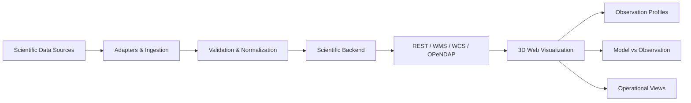

1. **Acquire:** Read multidimensional Copernicus Marine (CMEMS) NetCDF-4 archives, NOAA World Ocean Database (WOD) ragged-array observation files, and delimited text uploads.
2. **Adapt:** Convert heterogeneous dataset layouts into common internal structures through modular model and observation adapters.
3. **Validate:** Enforce geographic coordinate bounds ($-90^\circ \dots 90^\circ$ latitude, $-180^\circ \dots 180^\circ$ longitude), non-negative depths, ISO timestamps, and variable mappings.
4. **Serve:** Expose subsets and visual rasters through FastAPI REST routes, OGC WMS, OGC WCS, and OPeNDAP DAP2 services.
5. **Visualize:** Render the ocean in the browser using Three.js and custom WebGL2 shaders across global and regional 3D views.
6. **Compare:** Collocate discrete observation soundings with nearest model grid cells, timesteps, and depths to compute vertical residuals.
7. **Apply:** Present domain-focused views for marine hazard assessment, search and rescue support, fishery advisory, and climate archive analysis.

---

## 💡 From Fragmented Data to One Scientific Workspace

| Traditional Workflow | SagarDrishti-3D |
| :--- | :--- |
| Gridded model NetCDF files viewed in desktop GIS or command-line scripts | Model fields rendered directly in an interactive browser-based 3D volume |
| In-situ observation files inspected separately from model fields | Observation markers overlaid directly inside the same 3D ocean domain |
| Standalone static plots for vertical depth profiles | Interactive profile modal triggered directly from 3D spatial markers |
| Manual script writing for model-versus-observation verification | Automated collocated residual comparison ($\text{Obs} - \text{Model}$, Bias, MAE, RMSD) |
| Dataset-specific file downloads and custom parsers | Unified REST API + OGC WMS + OGC WCS + OPeNDAP DAP2 endpoints |
| 2D surface-only map inspection | 3D depth-resolved exploration with slices, ray marching, and isosurfaces |
| Fixed pre-rendered static images | Dynamic variable, depth, time, colormap, opacity, and vertical exaggeration controls |

---

## 🚀 What You Can Do

<table>
  <tr>
    <td width="50%" valign="top">
      <h3>🌐 Interactive 3D Ocean</h3>
      <ul>
        <li><strong>Global & Regional Views:</strong> Transition from an orbital 3D Earth globe to a bounded 3D regional ocean block.</li>
        <li><strong>3D Volume Rendering:</strong> WebGL2 GPU ray marching through a 3D data texture with emission-absorption compositing.</li>
        <li><strong>Horizontal Depth Slices:</strong> Multi-depth horizontal planes with contour borders.</li>
        <li><strong>3D Isosurfaces:</strong> Standalone Marching Cubes extraction for constant-value 3D envelopes.</li>
        <li><strong>Current Velocity Vectors:</strong> 3D directional arrows oriented and scaled by flow velocity.</li>
        <li><strong>Vertical Exaggeration:</strong> Interactive $1\times \to 10\times$ depth scaling slider.</li>
        <li><strong>Time Navigation:</strong> Scrub across 90 daily model steps (01 Jan 2026 – 31 Mar 2026).</li>
      </ul>
    </td>
    <td width="50%" valign="top">
      <h3>🌡️ Ocean Variables</h3>
      <ul>
        <li><strong>Potential Temperature (<code>thetao</code>):</strong> Thermal stratification and surface heat distribution ($^\circ\text{C}$).</li>
        <li><strong>Practical Salinity (<code>so</code>):</strong> Haline structure and freshwater plumes ($\text{PSU}$).</li>
        <li><strong>Eastward Velocity (<code>uo</code>):</strong> Zonal water-column velocity component ($\text{m/s}$).</li>
        <li><strong>Northward Velocity (<code>vo</code>):</strong> Meridional water-column velocity component ($\text{m/s}$).</li>
        <li><strong>Horizontal Current Speed:</strong> Computed vector magnitude:<br/>$$\text{speed} = \sqrt{u_o^2 + v_o^2}$$</li>
        <li><strong>Chlorophyll-a (<code>chl</code>):</strong> Biogeochemical phytoplankton pigment concentration ($\text{mg/m}^3$).</li>
      </ul>
    </td>
  </tr>
  <tr>
    <td width="50%" valign="top">
      <h3>🔬 In-Situ Observations</h3>
      <ul>
        <li><strong>Argo / PFL:</strong> Autonomous profiling float casts down to $2000\,\text{m}$.</li>
        <li><strong>Glider / GLD:</strong> High-density underwater glider transects.</li>
        <li><strong>CTD:</strong> Shipboard Conductivity-Temperature-Depth hydrographic casts.</li>
        <li><strong>BGC-Capable Platforms:</strong> Platforms carrying bio-optical chlorophyll sensors alongside physical sensors.</li>
        <li><strong>Profile Inspection:</strong> Click any marker to view platform ID, coordinates, timestamp, and depth-dependent measurement curves.</li>
      </ul>
    </td>
    <td width="50%" valign="top">
      <h3>📊 Model vs Observation & Controls</h3>
      <ul>
        <li><strong>Collocated Comparison:</strong> Matches an observation sounding to the nearest model grid cell, date, and depth levels.</li>
        <li><strong>Statistical Metrics:</strong> Computes layer-by-layer $\text{Observation} - \text{Model}$ residuals, Mean Bias, MAE, and RMSD.</li>
        <li><strong>Scientific Controls:</strong> Switch variables, select discrete depths, scrub timestamps, adjust color palettes (Turbo, Viridis, Plasma, Coolwarm, YlGn), tune opacity, and toggle vector density.</li>
      </ul>
    </td>
  </tr>
</table>

---

## 🗺️ Indian Ocean Study Region

The active numerical ocean model archive and spatial subsetting engine focus on the **Indian Ocean Basin**:

- **Latitude Bounds:** $35^\circ\text{S} \longrightarrow 30^\circ\text{N}$ (`-35.0` to `30.0`)
- **Longitude Bounds:** $40^\circ\text{E} \longrightarrow 100^\circ\text{E}$ (`40.0` to `100.0`)

### Key Sub-Basins Covered
- **Arabian Sea:** Western Indian Ocean upwelling zones, high-salinity water masses, and monsoon current systems.
- **Bay of Bengal:** Freshwater-influenced surface stratification, barrier layers, and coastal circulation.
- **Equatorial Indian Ocean:** Zonal equatorial jets, thermocline ridges, and cross-basin exchange pathways.

---

## 🛰️ Data Sources

| Source | Dataset | Content / Variables | Format |
| :--- | :--- | :--- | :--- |
| **Copernicus Marine (CMEMS)** | Global Ocean Physics (`GLORYS12V1`) | Potential Temperature (`thetao`), Practical Salinity (`so`), Eastward Velocity (`uo`), Northward Velocity (`vo`) | NetCDF-4 (`CF-1.4`) |
| **Copernicus Marine (CMEMS)** | Global Ocean Biogeochemistry (`FREEBIORYS2V4`) | Chlorophyll-a concentration (`chl`) | NetCDF-4 (`CF-1.6`) |
| **NOAA / NCEI World Ocean Database** | WOD Profiling Floats (`PFL` / Argo) | 22,231 vertical casts containing Temperature, Salinity, Pressure, and BGC measurements where equipped | NetCDF-4 Ragged Array |
| **NOAA / NCEI World Ocean Database** | WOD Autonomous Gliders (`GLD`) | 2,591 vertical glider profiles | NetCDF-4 Ragged Array |
| **NOAA / NCEI World Ocean Database** | WOD Shipboard CTD (`CTD`) | 619 hydrographic station casts | NetCDF-4 Ragged Array |
| **Marine Regions / VLIZ** | World EEZ Dataset v12 | Indian Exclusive Economic Zone (EEZ) maritime boundary polygons (MRGID 8480, 8333) | GeoJSON (`EPSG:4326`) |

> **Note on BGC Observations:** Not every Argo/PFL float carries biogeochemical sensors. The platform classifies an observation as BGC-capable only when valid bio-optical measurements (such as Chlorophyll-a) are present in the cast record.

---

## 📅 Current Data Coverage

| Parameter | Physical Model Archive (`copernicus_daily`) | Biogeochemical Archive (`copernicus_chlorophyll_daily`) |
| :--- | :--- | :--- |
| **Temporal Span** | **January 1, 2026 → March 31, 2026** | **January 1, 2026 → March 31, 2026** |
| **Timesteps** | **90 daily NetCDF files** | **90 daily NetCDF files** |
| **Latitude Range** | $-35.0^\circ\text{S}$ to $+30.0^\circ\text{N}$ ($781$ grid points) | $-35.0^\circ\text{S}$ to $+30.0^\circ\text{N}$ ($261$ grid points) |
| **Longitude Range** | $+40.0^\circ\text{E}$ to $+100.0^\circ\text{E}$ ($721$ grid points) | $+40.0^\circ\text{E}$ to $+100.0^\circ\text{E}$ ($241$ grid points) |
| **Horizontal Resolution** | $0.083^\circ \times 0.083^\circ$ ($\approx 9\,\text{km}$) | $0.25^\circ \times 0.25^\circ$ ($\approx 27\,\text{km}$) |
| **Vertical Depth Levels** | **40 levels** ($0.49\,\text{m} \longrightarrow 1941.89\,\text{m}$) | **54 levels** ($0.51\,\text{m} \longrightarrow 1945.30\,\text{m}$) |

---

## 🌐 Inside the 3D Explorer

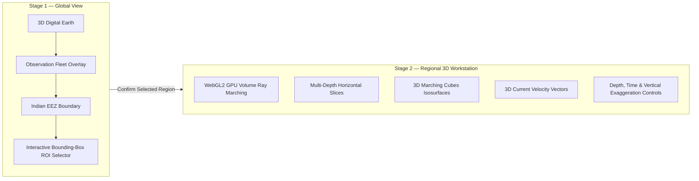

### Stage 1 — Global View
- **3D Digital Earth:** Interactive sphere with atmospheric shaders, country outlines, and high-resolution surface textures.
- **Observation Locations:** Renders in-situ platforms across the Indian Ocean with camera-distance level-of-detail (LOD) clustering.
- **Indian EEZ Layer:** Overlays the Indian maritime boundary polygons (`india_eez.geojson`) for regional spatial context.
- **ROI Selection:** Users click and drag a bounding box directly on the globe to isolate a custom latitude/longitude study sub-region and transition into Stage 2.

### Stage 2 — Regional Scientific Workstation
- **GPU Volume Rendering:** Casts rays through a `THREE.Data3DTexture` volume block representing the selected ocean region across depth.
- **Depth Slices:** Renders discrete horizontal planes from the surface down to deep water layers.
- **Isosurfaces:** Computes 3D triangle meshes along constant scalar thresholds using a standalone 256-entry Marching Cubes implementation (`src/lib/marchingCubes.ts`).
- **Current Vectors:** Renders 3D directional arrows oriented by $\theta = \text{atan2}(v_o, u_o)$ and scaled by $\text{speed} = \sqrt{u_o^2 + v_o^2}$.
- **Workstation Controls:** Adjust active variable, depth level, daily date, vertical exaggeration ($1\times \to 10\times$), isovalue threshold, and scientific colormaps.

---

## 🔬 From Marker to Scientific Profile

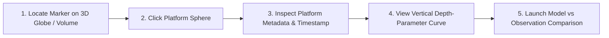

1. **Locate Marker:** Identify an observation platform by color-coded taxonomy (🟢 Argo, 🔵 Glider, 🟠 CTD, 🟣 BGC) on the 3D globe or inside the regional 3D volume.
2. **Select Platform:** Click the marker sphere in selection mode (`🎯`) or select it from the observation filter panel.
3. **Inspect Metadata:** View the platform identifier (e.g., `argo_19770705`), geographic coordinates (`latitude`, `longitude`), instrument category, and sounding timestamp.
4. **Analyze Depth Profile:** Examine the interactive vertical sounding graph plotting measured parameter values against water-column depth ($\text{m}$).
5. **Compare with Model:** Switch to the comparative analysis tab to evaluate how the in-situ profile aligns with the numerical ocean model at that location.

---

## 📊 Scientific Comparison

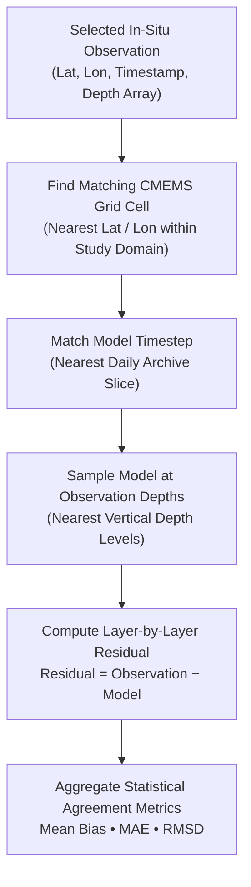

### Formulations Implemented (`backend/services/comparison_service.py`)

For each matched vertical depth level $i \in \{1, \dots, N\}$:

- **Layer Residual:**
  $$\text{Residual}_i = \text{Observation}_i - \text{Model}_i$$

- **Mean Bias:**
  $$\text{Bias} = \frac{1}{N} \sum_{i=1}^{N} (\text{Observation}_i - \text{Model}_i)$$

- **Mean Absolute Error (MAE):**
  $$\text{MAE} = \frac{1}{N} \sum_{i=1}^{N} |\text{Observation}_i - \text{Model}_i|$$

- **Root Mean Square Deviation (RMSD):**
  $$\text{RMSD} = \sqrt{\frac{1}{N} \sum_{i=1}^{N} (\text{Observation}_i - \text{Model}_i)^2}$$

---

## 📡 Open Scientific Data Services

<table>
  <tr>
    <td width="25%" valign="top">
      <h4>⚡ REST API</h4>
      <p>Application-facing JSON and binary endpoints serving spatial subgrids, multi-depth stacks, observation profiles, and residual analytics.</p>
    </td>
    <td width="25%" valign="top">
      <h4>🗺️ OGC WMS</h4>
      <p>Web Map Service (<code>1.3.0</code> &amp; <code>1.1.1</code>) rendering geo-referenced PNG/JPEG map rasters and legends directly from CMEMS NetCDF archives.</p>
    </td>
    <td width="25%" valign="top">
      <h4>🧊 OGC WCS</h4>
      <p>Web Coverage Service (<code>2.0.1</code> &amp; <code>1.0.0</code>) delivering multidimensional spatial/depth/time subset coverages as NetCDF-4 or GeoTIFF.</p>
    </td>
    <td width="25%" valign="top">
      <h4>🌐 OPeNDAP</h4>
      <p>DAP 2.0 wire-protocol server (<code>DDS</code>, <code>DAS</code>, <code>DODS</code>, HTML form, and THREDDS catalog) for remote multidimensional array slicing.</p>
    </td>
  </tr>
</table>

| Service | Supported Protocols / Versions | Purpose | Typical Consumer |
| :--- | :--- | :--- | :--- |
| **REST** | HTTP/1.1 JSON & Binary | Application data access & profile comparison | SagarDrishti-3D Web UI, Python/JS scripts |
| **WMS** | OGC WMS `1.3.0`, `1.1.1` | Rendered scientific map layers & color legends | QGIS, ArcGIS, Leaflet, OpenLayers |
| **WCS** | OGC WCS `2.0.1`, `1.0.0` | Subsetted gridded coverage downloads (`NetCDF-4`, `GeoTIFF`) | GIS analysts, GDAL, scientific workflows |
| **OPeNDAP** | DAP `2.0` & THREDDS `1.0` | Remote multidimensional dataset inspection & slicing | Python (`pydap`/`xarray`), MATLAB, R, CDO |

---

## 📥 Extensible Data Ingestion

The platform supports ingesting delimited observation files (`.csv`, `.tsv`, `.txt`, `.dat`, `.ascii`) alongside NetCDF archives:

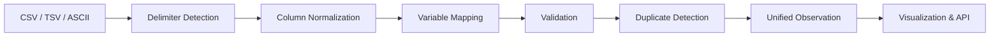

1. **Delimiter Detection:** Automatically identifies comma (`,`), tab (`\t`), semicolon (`;`), pipe (`|`), or whitespace delimiters.
2. **Column Normalization:** Maps diverse header conventions (`lat`/`latitude_deg_north`, `lon`/`lng`, `depth`/`pres_dbar`, `time`/`obs_time`) to canonical fields.
3. **Variable Mapping:** Resolves column names against the central `VariableRegistry` (`temperature`, `salinity`, `chlorophyll`, `u_velocity`, `v_velocity`).
4. **Scientific Validation:** Verifies coordinate bounds ($-90 \dots 90$, $-180 \dots 180$), non-negative depths, and valid timestamps; generates a structured `ValidationReport` (`VALID`, `PARTIALLY_VALID`, or `REJECTED`).
5. **Duplicate Prevention:** Computes SHA-256 file checksums in `backend/services/ingestion_service.py` to prevent duplicate ingestion of identical files placed in `data/incoming/`.

---

## 🧩 Built to Extend

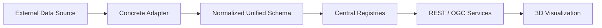

- **Adapter Registry (`backend/registry/adapters.py`):** Decouples API services from underlying file formats by mapping source IDs to `BaseModelAdapter` and `BaseObservationAdapter` classes.
- **Variable Registry (`backend/registry/variables.py`):** Centralizes standard variable identifiers, physical units, colormaps, valid value bounds, and column aliases.
- **Observation Type Registry (`backend/registry/observation_types.py`):** Manages platform taxonomies, marker styles, and profile capabilities.
- **Source Registry (`backend/registry/sources.py`):** Tracks dataset provenance, institutions, and metadata citations.

### Planned / Future Extensions
The registry layer defines clean extension hooks (`status="extension_ready"`, `is_active=False`) for future observing systems without generating synthetic data:
- **Moored Buoy Arrays (`mooring`)** — *Planned / Future*
- **Acoustic Doppler Current Profilers (`adcp`)** — *Planned / Future*
- **High-Frequency Coastal Radar (`hf_radar`)** — *Planned / Future*
- **Expanded Biogeochemical Variables (Dissolved Oxygen, Nitrate, pH)** — *Planned / Future*
- **Machine-Learning Derived Diagnostic Layers** — *Planned / Future*

---

## 🧭 Operational Application Views

The `/operational-applications` route provides four domain-specific perspectives demonstrating how integrated ocean model fields and in-situ soundings support marine analysis:

### 🌪 Hazard Assessment
- **Active Data Used:** CMEMS Potential Temperature (`thetao`), Practical Salinity (`so`), Horizontal Currents (`uo`, `vo`), and in-situ Argo/CTD soundings.
- **Visualization Value:** Examines sea surface thermal distribution, upper-ocean heat stratification, salinity fronts, and surface flow speeds across the Indian Ocean basin. *(Note: Provides physical ocean environment visualization; does not perform atmospheric cyclone track forecasting).*

### 🛟 Search & Rescue
- **Active Data Used:** Horizontal velocity components (`uo`, `vo`), vector current speed ($\text{speed} = \sqrt{u_o^2 + v_o^2}$), flow direction ($\text{atan2}(v_o, u_o)$), and nearby drifting profiling float positions.
- **Visualization Value:** Visualizes surface and sub-surface current vectors and velocity magnitudes to assist analysts in inspecting regional flow directions. *(Note: Visualizes Eulerian current velocity fields; does not perform automated Lagrangian particle drift forecasting).*

### 🐟 Fishery Advisory
- **Active Data Used:** CMEMS Chlorophyll-a concentration (`chl`), Potential Temperature (`thetao`), Ocean Currents, and BGC-capable observation soundings.
- **Visualization Value:** Highlights chlorophyll-rich productive waters, thermal fronts, and upwelling signatures across the Arabian Sea and Bay of Bengal. *(Note: Visualizes biophysical habitat indicators; does not perform fish-stock population prediction).*

### 🌍 Climate & Ocean Monitoring
- **Active Data Used:** Multi-depth Temperature (`thetao`) and Salinity (`so`) fields across the 90-day daily archive alongside deep-ocean WOD casts down to $2000\,\text{m}$.
- **Visualization Value:** Enables inspection of thermocline depth variation, halocline structure, and water-column stratification across time and depth. *(Note: Explores the available 90-day model and WOD observation archive; does not perform decadal climate prediction).*

---

## ⚡ Engineering Behind the Platform

- **Thread-Safe Bounded LRU NetCDF Handle Caching:** `CMEMSModelAdapter` maintains a thread-safe `OrderedDict` LRU cache (`_MAX_CACHE_HANDLES = 16`) protected by a `threading.Lock()`, preventing repeated disk open/close overhead across concurrent slice requests.
- **GZip HTTP Transport Compression:** FastAPI configures `GZipMiddleware` (`minimum_size=1400`, `compresslevel=6`) to compress JSON subgrids, observation lists, and GeoJSON boundaries.
- **$O(1)$ WOD Profile Lookup:** `WODObservationAdapter` precomputes cumulative offset arrays (`np.cumsum`) over ragged-array profile lengths (`z_row_size`, `Temperature_row_size`), allowing constant-time slice extraction for any cast index.
- **Per-Variable Ragged-Array Row-Size Indexing:** Independently indexes variable-specific row-size arrays in WOD NetCDF files so casts with partial sensor coverage decode without index misalignment.
- **Multi-Depth Field-Stack API:** `GET /api/v1/model/field-stack` extracts multiple depth planes in a single backend pass, minimizing round-trip HTTP latency during 3D volume construction.
- **Lazy `xarray` Subsetting & Adaptive Stride:** Subsets spatial bounding boxes (`lat_min..lat_max`, `lon_min..lon_max`) and applies configurable downsampling strides (`stride=1..8`) prior to loading data into memory.
- **`Float32` Numerical Processing:** Converts 64-bit model arrays to `float32` precision for compact serialization and direct WebGL texture upload.
- **Persistent Three.js GPU Resource Reuse:** Reuses `THREE.Data3DTexture`, `BufferGeometry`, `ShaderMaterial`, and `InstancedMesh` instances across parameter updates, calling explicit `.dispose()` routines on cleanup to avoid WebGL memory leaks.
- **Camera-Aware Observation LOD / Clustering:** Dynamically clusters dense observation markers at global zoom levels and resolves individual markers as the camera approaches the study region.
- **GPU Volume Ray Marching with Early Ray Termination:** Custom GLSL fragment shader steps through the 3D volume texture and terminates rays early when accumulated alpha reaches saturation.

---

## 🏗️ System Architecture

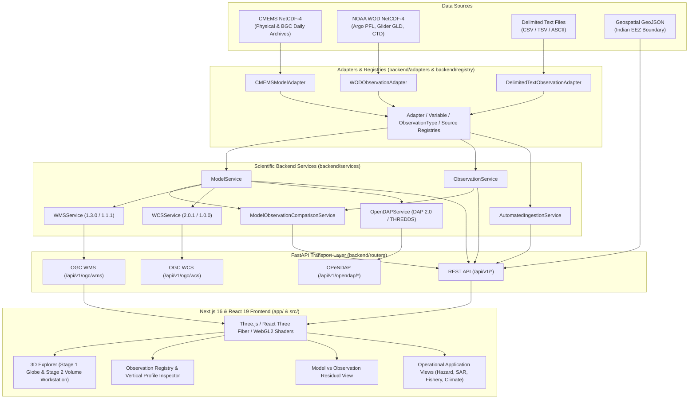

---

## 📁 Project Structure

```text
dhrishti-3d/
├── app/                                    # Next.js App Router pages
│   ├── about/page.tsx                      # Institutional context & architecture summary
│   ├── data-services/page.tsx              # Interactive OGC WMS/WCS, OPeNDAP & REST explorer
│   ├── explore/page.tsx                    # Main 3D Ocean Explorer workstation
│   ├── observations/page.tsx               # In-situ observation browser & profile viewer
│   ├── operational-applications/page.tsx   # Hazard, SAR, Fishery & Climate application views
│   ├── resources/page.tsx                  # Documentation & reference guides
│   ├── study-region/page.tsx               # Indian Ocean domain & parameter overview
│   ├── watch-demo/page.tsx                 # Platform walkthrough video player
│   └── page.tsx                            # Main portal landing page
├── backend/                                # Python FastAPI scientific server
│   ├── adapters/                           # CMEMS, WOD, and delimited-text data adapters
│   ├── registry/                           # Adapter, Variable, ObservationType & Source registries
│   ├── routers/                            # REST, Comparison, Geospatial, Ingestion, WMS, WCS, OPeNDAP
│   ├── schemas/                            # Pydantic models & UnifiedObservation schemas
│   ├── scripts/                            # EEZ boundary fetch & generation utilities
│   ├── serializers/                        # Binary grid serialization utilities
│   ├── services/                           # Core domain, comparison, ingestion & OGC services
│   ├── tests/                              # 102 automated Pytest unit & interoperability tests
│   ├── config.py                           # Environment & directory configuration
│   ├── main.py                             # FastAPI application entrypoint & middleware
│   └── Dockerfile.backend                  # Backend container specification
├── data/                                   # Scientific runtime dataset directory (populated from HF)
├── public/                                 # Static web assets
│   ├── data/                               # Lightweight pre-quantized binary store (<9 MB)
│   ├── landing/                            # Portal imagery & demo-video.mp4 placement directory
│   └── textures/                           # Earth surface, normal, specular & sky textures
├── screenshots/                            # Verified platform UI screenshots
├── src/                                    # Frontend components, 3D shaders & API clients
│   ├── components/                         # Stage 1 Globe, Stage 2 3D Viewport & Profile Modals
│   ├── lib/                                # Volume raymarcher, Marching Cubes & API clients
│   ├── scene/                              # Three.js scene graph & basemap components
│   └── ui/                                 # Guided tour, manual & concept cards
├── Caddyfile                               # Caddy reverse-proxy configuration
├── docker-compose.yml                      # Full-stack Docker Compose orchestration
├── Dockerfile.frontend                     # Multi-stage Frontend Nginx build
├── next.config.ts                          # Next.js static export configuration
├── package.json                            # Frontend dependencies & scripts
└── requirements.txt                        # Complete Python backend dependencies
```

---

## 📦 Download the Runtime Dataset

The complete raw scientific dataset (~17.8 GB uncompressed; ~9.3 GB archived) and the walkthrough video (~125 MB) exceed GitHub's file size limits and are hosted in a dedicated **Hugging Face Dataset Repository**:

👉 **[https://huggingface.co/datasets/kumar9513/data](https://huggingface.co/datasets/kumar9513/data)**

The Hugging Face repository contains three required items:
1. `data.zip` — Complete CMEMS daily physical & biogeochemical NetCDF archives (`model/`) and NOAA WOD NetCDF observation archives (`argo/`, `bgc/`, `ctd/`, `glider/`).
2. `geospatial and incoming.zip` — Contains the `geospatial/` directory (`india_eez.geojson`) and the `incoming/` directory for automated file ingestion.
3. `demo-video.mp4` — High-definition platform walkthrough video for the `/watch-demo` route.

---

### Step 1 — Get the dataset from Hugging Face

#### Option A: Using Git LFS
```bash
git lfs install
git clone https://huggingface.co/datasets/kumar9513/data hf-dataset
```

#### Option B: Using Python (`huggingface_hub`)
If you do not have Git LFS installed, download directly using Python:
```bash
pip install huggingface_hub
python -c "from huggingface_hub import snapshot_download; snapshot_download(repo_id='kumar9513/data', repo_type='dataset', local_dir='hf-dataset')"
```

---

### Step 2 — Extract the scientific data (`data.zip`)

Extract `hf-dataset/data.zip` so that its folders (`model/`, `argo/`, `bgc/`, `ctd/`, `glider/`) are placed directly inside the project's `data/` directory:

**Windows (PowerShell):**
```powershell
Expand-Archive -Path "hf-dataset\data.zip" -DestinationPath "data" -Force
```

**Linux / macOS:**
```bash
unzip -o hf-dataset/data.zip -d data/
```

---

### Step 3 — Extract geospatial and incoming data (`geospatial and incoming.zip`)

Extract `hf-dataset/geospatial and incoming.zip` directly into the project's `data/` directory:

**Windows (PowerShell):**
```powershell
Expand-Archive -Path "hf-dataset\geospatial and incoming.zip" -DestinationPath "data" -Force
```

**Linux / macOS:**
```bash
unzip -o "hf-dataset/geospatial and incoming.zip" -d data/
```

> ⚠️ **IMPORTANT:** Do **NOT** leave `geospatial and incoming.zip` as an unextracted `.zip` file inside `data/`. The backend expects the extracted folders `data/geospatial/india_eez.geojson` and `data/incoming/`.

---

### Step 4 — Add the Demo Video (`demo-video.mp4`)

Copy `hf-dataset/demo-video.mp4` into **`public/landing/demo-video.mp4`**:

**Windows (PowerShell):**
```powershell
Copy-Item -Path "hf-dataset\demo-video.mp4" -Destination "public\landing\demo-video.mp4" -Force
```

**Linux / macOS:**
```bash
cp hf-dataset/demo-video.mp4 public/landing/demo-video.mp4
```

> ⚠️ **IMPORTANT:** Do **NOT** put `demo-video.mp4` inside `data/`. It must be placed at `public/landing/demo-video.mp4` so the Next.js web server can stream it on the `/watch-demo` page.

---

### Final Expected Directory Tree After Extraction

Verify that your project root matches this exact layout before starting the servers:

```text
dhrishti-3d/
├── data/
│   ├── argo/
│   │   └── ocldb1788270080.21439_PFL.nc
│   ├── bgc/
│   │   ├── ocldb1788270080.21439_PFL.nc
│   │   └── source.md
│   ├── ctd/
│   │   └── ocldb1788270080.21439_CTD.nc
│   ├── glider/
│   │   └── ocldb1788270080.21439_GLD.nc
│   ├── geospatial/
│   │   └── india_eez.geojson
│   ├── incoming/
│   └── model/
│       ├── copernicus_daily/
│       │   └── cmems_mod_glo_phy-cur_anfc_0.083deg_P1D-m_2026-01-01T00-00-00.nc ... (90 files)
│       └── copernicus_chlorophyll_daily/
│           └── cmems_obs-oc_glo_bgc-plankton_my_l4-multi-4km_P1D_2026-01-01.nc ... (90 files)
│
├── public/
│   └── landing/
│       └── demo-video.mp4
│
├── backend/
├── app/
├── src/
├── requirements.txt
└── package.json
```

---

### ✅ Before Running Checklist

- [ ] GitHub repository cloned (`https://github.com/sihfinal/dhrishti-3d`)
- [ ] Hugging Face dataset downloaded (`https://huggingface.co/datasets/kumar9513/data`)
- [ ] `data.zip` extracted and scientific folders placed in `data/`
- [ ] `geospatial and incoming.zip` extracted and `geospatial/` + `incoming/` placed in `data/`
- [ ] `demo-video.mp4` copied to `public/landing/demo-video.mp4`
- [ ] Python virtual environment (`.venv`) created and activated
- [ ] Backend dependencies installed (`pip install -r requirements.txt`)
- [ ] Frontend dependencies installed (`pnpm install`)

---

## 🚀 Run SagarDrishti-3D

### 1. Clone the Project
```bash
git clone https://github.com/sihfinal/dhrishti-3d.git
cd dhrishti-3d
```

### 2. Install Frontend Dependencies
```bash
pnpm install
```

### 3. Setup Python & Install Backend Dependencies
Requires Python 3.10 or 3.11:
```bash
python -m venv .venv

# Activate on Windows (PowerShell):
.\.venv\Scripts\Activate.ps1

# Activate on Windows (CMD):
.\.venv\Scripts\activate.bat

# Activate on Linux / macOS:
source .venv/bin/activate

# Install all scientific & API dependencies:
pip install -r requirements.txt
```

### 4. Start the Backend Server (Terminal 1)
```bash
uvicorn backend.main:app --host 0.0.0.0 --port 8000 --reload
```
- **Backend API Root:** `http://localhost:8000`
- **Interactive Swagger / OpenAPI UI:** `http://localhost:8000/docs`
- **Health Check:** `http://localhost:8000/api/v1/health`

### 5. Start the Frontend Development Server (Terminal 2)
```bash
pnpm dev
```

### 6. Open the Application
Navigate to **[`http://localhost:3000`](http://localhost:3000)** in your web browser.

---

## 🧑‍💻 First 5 Minutes

Follow this sequence to experience the complete scientific workflow:

1. **01 — Open the Platform:** Launch `http://localhost:3000` to view the main portal and dataset summary cards.
2. **02 — Understand the Region:** Click **Study Region** (`/study-region`) to review the Indian Ocean domain ($35^\circ\text{S} - 30^\circ\text{N}$, $40^\circ\text{E} - 100^\circ\text{E}$) and observing systems.
3. **03 — Enter Explorer:** Click **Launch 3D Explorer** (`/explore`) to enter the Stage 1 Global Marine Globe.
4. **04 — Choose a Variable:** Toggle between **Temperature**, **Salinity**, **Currents**, and **Chlorophyll** in the left data-layer panel.
5. **05 — Explore Depth:** Drag the **Depth Slider** ($0\,\text{m} \to 2000\,\text{m}$) to observe how subsurface temperature and salinity structures evolve with depth.
6. **06 — Explore Time:** Scrub the **Time Slider** across the 90 daily steps from `01 Jan 2026` to `31 Mar 2026`.
7. **07 — Select a Region of Interest (Stage 2):** Enable **Select Region**, drag a box over the Arabian Sea or Bay of Bengal, and confirm to enter the **Stage 2 3D Volumetric Workstation** with GPU ray marching, depth slices, isosurfaces, and 3D current vectors.
8. **08 — Inspect an Observation Profile:** Click any in-situ marker sphere (Argo, Glider, CTD, or BGC) to open its vertical depth-measurement profile.
9. **09 — Compare Model vs Observation:** Inside the profile modal, run the collocated comparison to view layer-by-layer $\text{Observation} - \text{Model}$ residuals, Bias, MAE, and RMSD.
10. **10 — Explore Open Standards:** Open **Data Services** (`/data-services`) to test live OGC WMS map rendering, WCS NetCDF/GeoTIFF coverage downloads, and OPeNDAP DAP2 endpoints.

---

## 🔌 API Quick Reference

All endpoints are verified against `backend/routers/` and `backend/main.py`:

| Endpoint | Method | Purpose |
| :--- | :---: | :--- |
| `/api/v1/health` | `GET` | Service readiness, adapter status, and dataset availability |
| `/api/v1/datasets` | `GET` | Registered model and observation dataset catalog |
| `/api/v1/model/metadata` | `GET` | Spatial bounds, depth array, time range, and variable definitions |
| `/api/v1/model/times` | `GET` | Available daily model timestamps (`2026-01-01` to `2026-03-31`) |
| `/api/v1/model/depths` | `GET` | Available discrete vertical depth levels ($\text{m}$) |
| `/api/v1/model/field` | `GET` | 2D horizontal subgrid slice for a variable, depth, time, and bounding box |
| `/api/v1/model/field-stack` | `GET` | Multi-depth 3D slab stack in a single request |
| `/api/v1/observations` | `GET` | Spatial, temporal, and platform-type filtered observation soundings |
| `/api/v1/observations/{id}` | `GET` | Metadata and location details for a specific observation cast |
| `/api/v1/observations/{id}/profile` | `GET` | Full vertical depth-dependent arrays (`depth`, `temperature`, `salinity`, `chlorophyll`) |
| `/api/v1/compare/model-observation` | `GET` | Collocated vertical comparison and statistical error metrics (`Bias`, `MAE`, `RMSD`) |
| `/api/v1/geospatial/india-eez` | `GET` | Authoritative Marine Regions VLIZ v12 Indian EEZ GeoJSON boundary |
| `/api/v1/geospatial/info` | `GET` | Metadata, area ($2,323,948\,\text{km}^2$), and citation for geospatial layers |
| `/api/v1/ingestion/status` | `GET` | Scan `data/incoming/` and report file validation & ingestion job lifecycle |
| `/api/v1/ingestion/upload` | `POST` | Upload and ingest a CSV/TSV/ASCII observation file |
| `/api/v1/ogc/wms` | `GET` | OGC Web Map Service (`1.3.0` & `1.1.1`) endpoint |
| `/api/v1/ogc/wcs` | `GET` | OGC Web Coverage Service (`2.0.1` & `1.0.0`) endpoint |
| `/api/v1/opendap/*` | `GET` | OPeNDAP DAP 2.0 (`DDS`, `DAS`, `DODS`, `HTML`) and THREDDS `catalog.xml` |

---

## 🌐 Scientific Interoperability Services

<details>
<summary><strong>🗺️ OGC WMS (Web Map Service 1.3.0 & 1.1.1)</strong></summary>

<br />

Implemented in `backend/services/wms_service.py` and `backend/routers/wms.py`. Generates 2D geo-referenced rasters directly from the CMEMS NetCDF archives.

- **Supported Operations:** `GetCapabilities`, `GetMap`, `GetLegendGraphic`
- **Supported Layers:** `temperature`, `salinity`, `currents`, `chlorophyll`, `u_velocity`, `v_velocity`
- **Supported Colormaps (`STYLES`):** `turbo`, `viridis`, `plasma`, `coolwarm`, `YlGn`
- **Supported CRS:** `EPSG:4326`, `CRS:84`, `EPSG:3857`
- **Example `GetMap` Request:**
  ```text
  http://localhost:8000/api/v1/ogc/wms?SERVICE=WMS&REQUEST=GetMap&VERSION=1.3.0&LAYERS=temperature&STYLES=turbo&CRS=EPSG:4326&BBOX=-20,55,15,85&WIDTH=800&HEIGHT=600&FORMAT=image/png&TIME=2026-02-15&ELEVATION=0.5
  ```

</details>

<details>
<summary><strong>🧊 OGC WCS (Web Coverage Service 2.0.1 & 1.0.0)</strong></summary>

<br />

Implemented in `backend/services/wcs_service.py` and `backend/routers/wcs.py`. Extracts multidimensional scientific subsets in binary NetCDF-4 or GeoTIFF formats.

- **Supported Operations:** `GetCapabilities`, `DescribeCoverage`, `GetCoverage`
- **Supported Coverages:** `temperature`, `salinity`, `currents`, `chlorophyll`, `u_velocity`, `v_velocity`
- **Supported Output Formats:** `application/x-netcdf` (NetCDF-4), `image/tiff` (GeoTIFF)
- **Example `GetCoverage` Request:**
  ```text
  http://localhost:8000/api/v1/ogc/wcs?SERVICE=WCS&REQUEST=GetCoverage&VERSION=2.0.1&COVERAGEID=temperature&SUBSET=Lat(-20,15)&SUBSET=Long(55,85)&SUBSET=time("2026-02-15")&SUBSET=elevation(0.5)&FORMAT=application/x-netcdf
  ```

</details>

<details>
<summary><strong>🌐 OPeNDAP DAP 2.0 & THREDDS Catalog</strong></summary>

<br />

Implemented in `backend/services/opendap_service.py` and `backend/routers/opendap.py`. Exposes multidimensional array slicing over the DAP2 wire protocol.

- **Available Datasets:** `cmems_physical`, `cmems_bgc`
- **Supported Endpoints:**
  - `GET /api/v1/opendap/catalog.xml` — THREDDS XML Dataset Catalog
  - `GET /api/v1/opendap/cmems_physical.dds` — Dataset Descriptor Structure
  - `GET /api/v1/opendap/cmems_physical.das` — Dataset Attribute Structure
  - `GET /api/v1/opendap/cmems_physical.dods?thetao[0:1:0][0:1:2][10:1:20][10:1:20]` — Binary XDR Data Stream
  - `GET /api/v1/opendap/cmems_physical.html` — Interactive Web Subsetting Form

</details>

---

## 🧪 Verification

Both the Python scientific backend and the Next.js TypeScript frontend have been executed and verified against the current repository state.

### 1. Backend Test Suite (`pytest`)
```bash
pytest backend/tests
```

```text
============================= test session starts =============================
platform win32 -- Python 3.11.5, pytest-9.1.1, pluggy-1.6.0
collected 102 items

backend\tests\test_api.py ........................................       [ 39%]
backend\tests\test_comparison.py ....                                    [ 43%]
backend\tests\test_delimited_text_and_ingestion.py ........              [ 50%]
backend\tests\test_extensible_architecture.py ...............            [ 65%]
backend\tests\test_geospatial.py ..                                      [ 67%]
backend\tests\test_opendap.py .............                              [ 80%]
backend\tests\test_wcs.py ..........                                     [ 90%]
backend\tests\test_wms.py ..........                                     [100%]

====================== 102 passed, 2 warnings in 56.73s =======================
```

### 2. Frontend Production Build (`next build`)
```bash
pnpm build
```
- **Verified Result:** Compiled cleanly in `13.1s` using Next.js 16.3.1 (Turbopack) with zero TypeScript errors across all 13 static routes (`/`, `/about`, `/data-services`, `/explore`, `/observations`, `/operational-applications`, `/resources`, `/study-region`, `/watch-demo`).

---

## 🔒 Security & Data Integrity

- **Path Traversal Protection:** File access inside `ingestion_service.py` and dataset routers resolves paths strictly within `data/` and `data/incoming/`, rejecting parent-directory traversal (`..`).
- **Coordinate & Depth Validation:** Request parameters and ingested files validate geographic coordinates ($-90^\circ \le \text{lat} \le 90^\circ$, $-180^\circ \le \text{lon} \le 180^\circ$) and non-negative depth values ($\text{depth} \ge 0$).
- **Upload Extension Whitelisting:** Ingestion endpoints restrict files to `.csv`, `.tsv`, `.txt`, `.dat`, `.ascii`, and `.nc`.
- **SHA-256 Duplicate Detection:** Every ingested file is fingerprinted using SHA-256 (`_compute_file_hash`) so repeated uploads or directory scans are marked `SKIPPED_DUPLICATE`.
- **WMS Raster Dimension Limits:** `WMSService` validates `WIDTH` and `HEIGHT` parameters (bounded up to $2048 \times 2048$) to prevent excessive memory allocation.

---

## 🐳 Deployment

The project includes production container and reverse-proxy configurations:

### Option 1: Docker Compose (`docker-compose.yml`)
Builds both the Nginx static frontend (`Dockerfile.frontend`) and the FastAPI Uvicorn backend (`backend/Dockerfile.backend`), mounting `./data` into `/app/data`:
```bash
docker compose up -d --build
```
- Frontend container: `http://localhost:3000`
- Backend container: `http://localhost:8000`

### Option 2: Caddy Reverse Proxy (`Caddyfile`)
Serves the static frontend export (`out/`) and reverse-proxies `/api/v1/*` requests to `localhost:8000` on a single port (`:8080`):
```bash
pnpm build
uvicorn backend.main:app --host 0.0.0.0 --port 8000
caddy run --config Caddyfile
```

---

## 🔭 Future Extensions

To maintain strict transparency between the current working system and future possibilities, the following items are designated as **Planned / Future** work:

| Extension | Current Status in Repository | Future Scope |
| :--- | :---: | :--- |
| **Moored Buoy Arrays (`mooring`)** | **Planned / Future** (Registry hook `is_active=False`) | Integration of fixed Eulerian time-series buoy networks (e.g., OMNI / RAMA buoys) |
| **Acoustic Doppler Current Profilers (`adcp`)** | **Planned / Future** (Registry hook `is_active=False`) | High-frequency vertical velocity profile ingestion from vessel-mounted ADCPs |
| **High-Frequency Coastal Radar (`hf_radar`)** | **Planned / Future** (Registry hook `is_active=False`) | Coastal surface current radar vector grids |
| **Additional Biogeochemical Parameters** | **Planned / Future** | Full 3D model comparison for dissolved oxygen ($\text{O}_2$), nitrate ($\text{NO}_3$), and pH |
| **ML-Derived Ocean Products** | **Planned / Future** | Data-driven eddy detection and subsurface anomaly diagnostics |

---

## 🤝 Acknowledgements

- **Indian National Centre for Ocean Information Services (INCOIS)**, Ministry of Earth Sciences (MoES), Government of India — Problem Statement formulation and scientific domain context under Smart India Hackathon 2026 (PS 26067).
- **Copernicus Marine Service (CMEMS)** — Global Ocean Physics (`GLORYS12V1`) and Biogeochemical (`FREEBIORYS2V4`) daily numerical model datasets.
- **NOAA National Centers for Environmental Information (NCEI)** — World Ocean Database (WOD) in-situ profiling float (`PFL`), autonomous glider (`GLD`), and shipboard `CTD` archives.
- **Flanders Marine Institute (VLIZ)** — Marine Regions World EEZ Dataset v12 (`india_eez.geojson`).

---

## 📄 License

License: Not yet specified.

---

<div align="center">
  <strong>Built for Smart India Hackathon 2026 — SIH 26067</strong>
</div>
